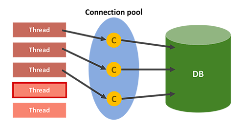

데이터베이스 풀
===

## Connection Pool
- 어플리케이션의 스레드에서 데이터베이스에 접근하기 위해서는 Connection이 필요하다.
- Connection pool은 이런 Connection을 여러 개 생성해 두어 저장해 놓는 공간, 또는 이 공간의 Connection을 필요할 때 꺼내 쓰고 반환하는 기법을 말한다.

## 필요성
Connection pool은 외부 연결이 필요하며 생성비용이 비싸다.
그래서 (보통) 애플리케이션 초기화 시점에 미리 Connection 객체들을 생성해놓고 사용하는 것이다.

### 비싼 생성 및 종료 비용
- 네트워크 오버헤드
- 인증과 권한 검사가 필요
- 메모리, CPU 시간  리소스를 포함
### DB 접근 시간 단축
- 미리 만들어 놓았기때문에 접근 시간이 단축된다.
### 메모리와 DB에 걸리는 부하 조정
- DB에 접근하는 Connection 수를 제한해서 걸리는 부하를 조정 할 수 있다.

## DB에 접근하는 단계
1. 웹 컨테이너가 실행되면서 DB와 연결된 Connection 객체들을 미리 생성하여 pool에 저장
2. DB에 요청 시, pool에서 Connection 객체를 가져와 DB에 접근
3. 처리가 끝나면 다시 pool에 반환

## 남은 Connection이 없을 때
- 모든 요청이 DB에 접근하고 있는데 남은 Connection이 없다면,
  해당 클라이언트는 대기 상태로 전환
- Pool에 Connection이 반환되면 대기 상태의 클라이언트에게 순차적으로 제공

## Thread Pool
비슷한 맥락으로 Thread Pool이라는 개념도 있다.
Connection Pool과 유사하다. 매 요청마다 Thread를 만들지 않고,
Thread Pool을 통해 미리 생성한 Thread를 재사용한다.

### 남은 쓰레드가 없을때
- 최대 Thread를 사용중이라 남은 Thread가 없다면,기다리는 요청은 거절하거 특정 숫자만큼 대기하도록 설정할 수 있다.

### Thread Pool, Connection Pool의 max 설정
WAS에서 Thread와 Connection의 수는 직접적으로 메모리와 관련있다. 적정수로 max 수를 지정해주는게 중요하다.
- 너무 많이 생성하면 메모를 많이 점유하게 된다. 리소스 임계점이 초과되면 서버가 다운된다.
- 메모리를 위해 적게 지정한다면, 서버 리소스는 여유롭지만 클라이언트는 응답 지연이 되게 된다.
- 모든 요청이 DB에 접근하는 작업이 아니기 때문에 보통 WAS의 Thread의 수가 Conncetion의 수보다 많은 것이 좋다.

### 참고 및 사진 출처
- [WeareSoft 데이터베이스 풀](https://github.com/WeareSoft/tech-interview/blob/master/contents/db.md#%EB%8D%B0%EC%9D%B4%ED%84%B0%EB%B2%A0%EC%9D%B4%EC%8A%A4-%ED%92%80)
- 영한님 MVC 1 강의
    - 읽어보면 좋을 글 [우형 블로그](https://techblog.woowahan.com/2663/) - HikariCP 데드락을 피하는 풀 사이즈