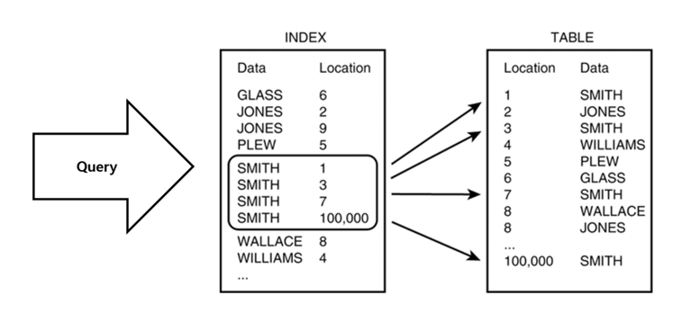

Index
===

- 데이터베이스의 검색 속도를 향상시키기 위한 기술/방법 혹은 자료구조를 뜻한다.
- 데이터와 데이터의 위치를 포함한 자료구조를 생성하여 빠른 조회를 돕는다.
  - 책의 색인과 유사하다. 테이블의 칼럼을 색인화해서 파일로 생성한다. 
  - 해당 테이블의 로우들을 full scan 할 필요가 없어진다.
- 테이블의 기본 키는 자동으로 인덱스된다.
- 데이터베이스의 약 10%의 저장 공간이 필요하다.

## 파일
MySQL에서는 주로 두 가지 스토리지 엔진을 사용한다. 인덱스를 다루는 구조가 조금 다르다.
### MyISAM 엔진
- .FRM 파일: 테이블 구조를 저장. 각 테이블마다 하나의 .FRM 파일이 있다. 테이블에 대한 메타데이터, 테이블의 구조를 설명하는 정보를 저장한다.
- .MYD (MYData) 파일: 실제 행 데이터를 저장
- .MYI (MYIndex) 파일: B-Tree 데이터 구조를 사용하여 테이블에 대 인덱스 정보를 저장하며, 디스크에서 빠르게 데이터를 조회할 수 있다.
이후에 사용자가 Select 쿼리로 Index를 사용하는 Column을 탐색 시, MYI 파일의 내용을 검색함.

### InnoDB 엔진
InnoDB는 테이블 데이터와 인덱스를 테이블 공간(tablespace)에 저장한다. 기본적으로 이 테이블 공간은 시스템 테이블 공간(일반적으로 "ibdata" 파일들)으로 알려져 있다.
하지만, ibdate 파일의 단점을 극복하기 위해서, **테이블별 공간(tablespace) 설정을 사용하는 경우**에는 InnoDB는 각 테이블에 대해 별도의 `.ibd` 파일을 생성하며, 각 테이블의 데이터와 인덱스를 이 파일에 저장한다.

- .FRM 파일: 테이블 구조를 저장
- ibdata 파일: 실제 행 데이터와 인덱스 데이터를 함께 저장
- .IBD 파일: (테이블별 공간 설정을 사용하는 경우) 각 테이블의 데이터와 인덱스 저장

### 단점
- 한 페이지를 동시에 수정할 수 있는 병행성이 줄어듬.
  - 데이터가 변경되면 인덱스도 변경이 필요하다. 인덱스도 locking이 되기 때문에 병행성이 떨어질 수 있다.
- 인덱스 된 필드에서 데이터를 업데이트하거나, 레코드를 추가 또는 삭제시 성능이 떨어짐.
- 데이터 변경이 자주 일어나는 경우, 인덱스도 변경해야 하므로 성능에 영향을 미친다.
- 무분별한 인덱스의 사용은 성능에 부정적인 영향을 미칠 수 있다.
### 간략한 동작
1. Index Table에서 where에 포함된 값을 검색
2. 해당 값의 table_id PK를 획득 
3. 가져온 table_id PK값으로 원본 테이블에서 값을 조회

## B+tree 사용 이유
### 왜 index 생성 시 hash table이 아닌 b-tree를 사용하는지?
- SELECT 질의 조건에는 부등호 연산(<>)도 포함 
- hash table은 동등 연산에 특화된 자료구조이기 때문에 부등호 연산 사용 시 문제 발생
### B-Tree 장점
- 디스크 작업에서 블록 단위로 데이터를 불러오는데 최적화되어 있다. 한 번의 디스크 I/O 작업으로 노드의 여러 키에 접근할 수 있다.
- 균형을 유지한다.

## 사용하는 상황
- 무분별한 인덱스의 사용은 성능에 부정적인 영향을 미칠 수 있다.
  - 인덱스는 유용하지만 오버헤드가 생기므로 성능저하에 유의해야 한다.
  - 인덱스는 따로 테이블의 형태로 관리가 되어 자원을 소모함을 기억하자.
### 사용하면 좋은 경우
- where, join, order by 등 검색 조건에서 자주 사용되는 컬럼
- 외래키가 사용되는 컬럼 
  - 조인 성능 향상, 데이터 검색 속도 향, 데이터 무결성 유지 작업 속도 향
- 업데이트 ,삭제가 빈번하지 않은 컬럼
- 중복도가 낮은(카디널리티가 높은) 컬럼

### 사용을 피해야 하는 경우
- DML를 자주 쓰는 컬럼(빈번한 업데이트)
- 데이터 중복도가 높은(카디널리티가 낮은) 칼럼 (예 : 성별)
  - 다중 컬럼 인덱싱할 때 카디널리티가 높은 컬럼-> 낮은 컬럼 순으로 인덱싱해야 효율적이다.
- 데이터 크기가 큰 컬럼
  - 공간 사용량 증가, 성능 저하 가능성

## DML 동작
### INSERT
  - 테이블에는 입력 순서대로 저장되지만, 인덱스 테이블에는 정렬하여 저장한다. (성능 저하 가능성)
  - 기존 블록에 여유 공간이 없는 상황에서 그 블록에 새로운 데이터가 입력되어야 한다면  
### DELETE 
  - 테이블에서만 삭제되고 인덱스 테이블에는 데이터가 남아있어 사용 안됨 표시만 해둔다. (쿼리 수행 속도 저하 가능성)
  - Table Data 수와 Index Data 수가 다를 수 있다.
### UPDATE
  - 인덱스에는 UPDATE가 없기 때문에 DELETE, INSERT 두배의 작업이 필요하다. (부하 발생 가능성)

## 참고 및 출처 
- (gyoogle index)[https://gyoogle.dev/blog/computer-science/data-base/Index-.html]
- (WeareSoft index)[https://github.com/WeareSoft/tech-interview/blob/master/contents/db.md#index%EB%9E%80]
- (드럼치는 코린이님 블로그)[https://choicode.tistory.com/27]