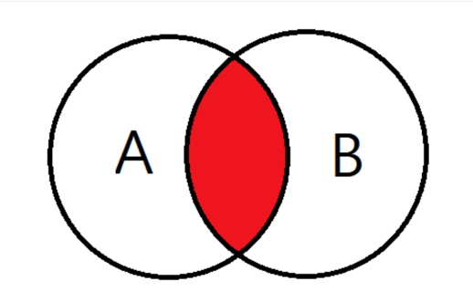
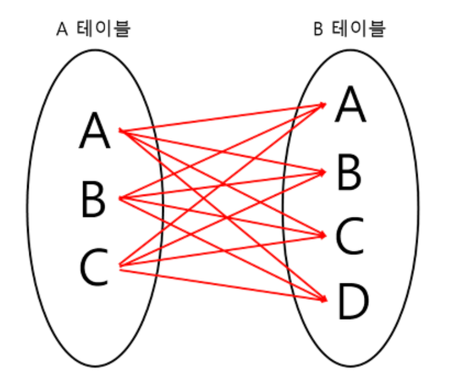
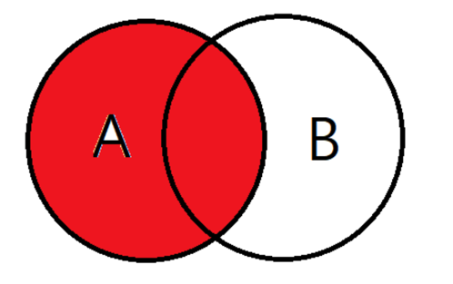
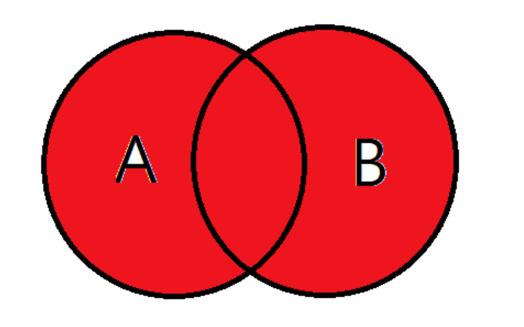
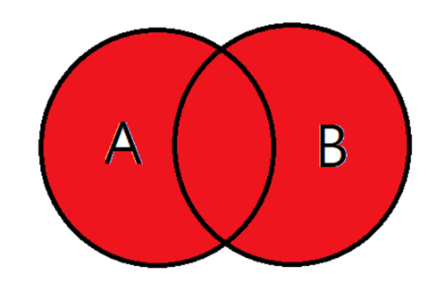
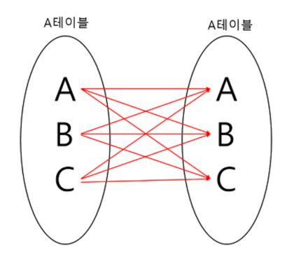

Join
===
- 2개 이상의 테이블이나 데이터베이스를 연결하여 데이터를 검색하는 방법
테이블을 연결하려면 적어도 하나의 칼럼을 서로 공유하고 있어야 한다. 그것을 기준으로 데이터 검색을 한다.

## 종류 및 설명
- INNER JOIN
- LEFT OUTER JOIN
- RIGHT OUTER JOIN
- FULL OUTER JOIN
- CROSS JOIN
- SELF JOIN

### INNER JOIN

- 교집합, 기준 테이블과 조인 테이블에서 중복된 값을 보여준다.
- 기본 조인 형식으로 간주한다. inner은 암시적으로 생략할 수 있다.
```sql
SELECT * FROM employee 
    (INNER) JOIN department
    ON employee.DepartmentID = department.DepartmentID;
```

내부 조인을 더 세부적으로 동일 조인(Equi-Join), 자연 조인(natural join), 또는 교차 조인(cross-join)으로 나눌 수 있다.

#### 동등 조인 (Equi-JOIN)
- 동등 조인은 두 테이블 간에 동일한 값을 가진 행을 결합하는 방식
- 동등 조인은 보통 = 연산자를 사용하여 JOIN 조건을 생성
- =가 아닌 다른 비교 연산자를 사용하는 것은 동등 조인이 아니다.

#### 자연 조인 (Natural JOIN)
- 자연 조인은 두 테이블 간에 동일한 이름을 가진 모든 열에 대해 동등 조인을 수행하는 방식
- 자연 조인에서는 명시적으로 조인 조건을 제공하지 않는다.
  - 대신 SQL 엔진은 두 테이블의 동일한 이름의 칼럼을 찾아내어 자동으로 이들을 기반으로 조인을 수행한다.
  - 2개의 테이블에서 모든 컬럼들을 비교하는 암시적 구문이다.
  - 다른 테이블에 다른 컬럼으로 동일한 이름을 가진 새로운 컬럼을 추가하면 문제가 된다.
```sql
SELECT * FROM employee NATURAL JOIN department;
```
#### CROSS JOIN

- 곱집합을 반환한다.
- 조인 조건이 없으며, 두 테이블의 모든 행이 서로 결합된다.
- 활용 : 조합 생성, 테스트 데이터 생성, 통계적 모델링 및 분석

### LEFT OUTER JOIN

- 기준 테이블값과 조인 테이블과 중복된 값을 보여준다.
- 왼쪽 테이블을 기준으로 조인한다. 
  - 왼쪽 테이블의 모든 테이터를 포함하는 결과가 생겨난다.
  - 좌측 테이블에 값이 있다면 오른쪽 테이블에 조인할 컬럼의 값이 없는 경우 null로 표시된다.

```sql
  SELECT * FROM employee
    LEFT OUTER JOIN department
    ON employee.DepartmentID = department.DepartmentID;
```  
### RIGHT OUTER JOIN

- 오른쪽 테이블을 기준으로 조인한다.
  - 오른쪽 테이블의 모든 데이터를 포함하는 결과가 나온다.
  - left outer와 반대로 좌측 테이블에 조인할 컬럼의 값이 없는 경우 사용한다.
```sql
  SELECT * FROM employee
    RIGHT OUTER JOIN department
    ON employee.DepartmentID = department.DepartmentID;
```  
### FULL OUTER JOIN

- 합집합, 양쪽 테이블 모두의 데이터가 검색된다.
```sql
  SELECT * FROM employee
    FULL OUTER JOIN department
    ON employee.DepartmentID = department.DepartmentID;
```  

```sql
SELECT * FROM MEMBER CROSS JOIN TEAM;
SELECT * FROM MEMBER, TEAM;
```
### 자가 조인(SELF JOIN)

- 한 테이블에서 자기 자신에 조인을 시키는 것
- 자신이 갖고 있는 컬럼을 다양하게 변형시켜 활용 가능하다.

### 세타 조인 (Theta-JOIN)
- 두 테이블 간에 임의의 조건을 사용하여 행을 결합하는 방식. 쉽게 말해 조인 조건에 비교 연산자를 사용해 테이블을 결합한다.
- 동등 조인과는 달리, = 연산자 외에 다른 연산자 (예: <, >, <=, >=, != 등)를 사용할 수 있다.
- 다음처럼 cross 조인 형식에도 사용할 수 있다.
```sql
SELECT * FROM MEMBER m, TEAM t WHERE m.username = t.name;
```

### 비동등 조인 (Non-Equi JOIN)
- 연산자가 아닌 다른 비교 연산자 (예: <, >, <=, >= 등)를 사용하여 테이블을 결합
- 비동등 조인은 세타 조인의 일종으로 볼 수 있지만, 세타 조인은 = 연산자를 포함한 여러 연산자를 사용할 수 있고 비동등 조인은 = 연산자를 사용하지 않는다.


## 참고 및 출처
- (위키백과)[https://ko.wikipedia.org/wiki/Join_(SQL)]
- (WeareSoft Join)[https://github.com/WeareSoft/tech-interview/blob/master/contents/db.md#join]
- (gyoogle Join)[https://gyoogle.dev/blog/computer-science/data-base/Join.html]
- (코딩팩토리)[https://coding-factory.tistory.com/87]