정규화(Normalization) 1, 2, BCNF
===
- 데이터 구조를 개선하여 중복을 제거하고, 무결성을 유지하는 과정
- 삽입/수정/삭제 이상을 최소화한다.
- 정규화 되기 위해 준수해야 되는 rule을 normal form(NF)라고 부른다.
  - 1NF -> 2NF -> 3NF -> BCNF -> 4NF -> 5NF -> 6NF
  - 앞 과정을 만족해야 다음으로 넘어갈 수 있미. BCNF 만족 -> 1,2,3NF를 이미 만족한다는 의미

## 용어 정리
### 기본 용어
- 애트리뷰트 = 속성 : 열, 데이터 유형(카테고리)를 나타낸다. 
- 튜플 = 레코드 : 행, 데이터 세트
- 차수 : 한 릴레이션 어트리뷰트 수
- 카디널리티 : 한 릴레이션 튜플의 개수

### 슈퍼키(super key)
- 테이블에서 튜플들을 유일(unique)하게 식별할 수 있는 어트리뷰트 집합
- 후보키에 잔챙이들을 붙이면 슈퍼키다.
### 후보키((candidate) key)
- 한 어트리뷰트라도 제거하면 유일하게 튜플을 식별할 수 없는 슈퍼키로 더 이상 줄일 수 없는 형태이다.
- 기본키가 되기 위한 후보라서 후보키란 이름이 되었다.
### 기본키(primary key)
- 테이블에서 튜플들을 유일하게 식별하기 위해 선택된 (후보)키
### 대체키(Alternate Key)
- 기본키로 지정하고 남은 후보키
### 복합 기본키(composite primary key)
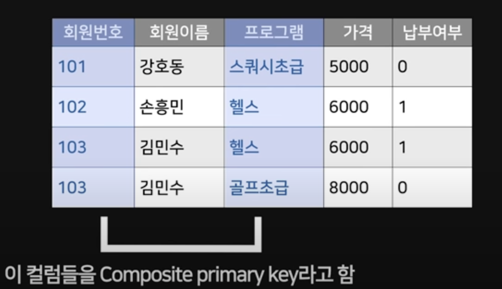 *출처 코딩애플님 강의*
- 2개 이상의 속성 합쳐서 기본키 역할을 수행하는 경우

## 함수 종속성
- 데이터들이 어떤 기준 값에 종속되는 현상
- ex) 회원번호에 따라 회원이름이 결정되는 경우, 다음처럼 표현 가능하다.
  - 회원번호 -> 회원이름
  - 회원이름은 회원번호에 종속된다.
  - 회원이름은 회원번호에 함수적으로 종속된다.
### 부분 함수적 종속성(Partially Functional Dependency)
- (복합키인) 릴레이션에서 특정 속성이 기본 키의 일부분에만 의존하는 경우
- 복합키의 한 속성에 종속되는 속성이 있다면, partial dependency를 가지는 것
### 완전 함수적 종속성(Fully Functional Dependency)
- 복합키 전체에 종속되는 것을 말한다.
- 특수한 경우를 제외하고 기본키가 한 개의 속성을 가진다면 완전 함수적 종속성을 지닌다.
### 기본 속성(prime attribute)
- (후보) 키에 있는 속성들
### 비기본 속성(non-prime attribute)
- 기본 속성을 제외한 속성들

# 정규화 및 정규화 예시
> 예시는 모두 [쉬운코드님의 강의](https://www.youtube.com/watch?v=EdkjkifH-m8&list=PLcXyemr8ZeoREWGhhZi5FZs6cvymjIBVe&index=23) 내용입니다.
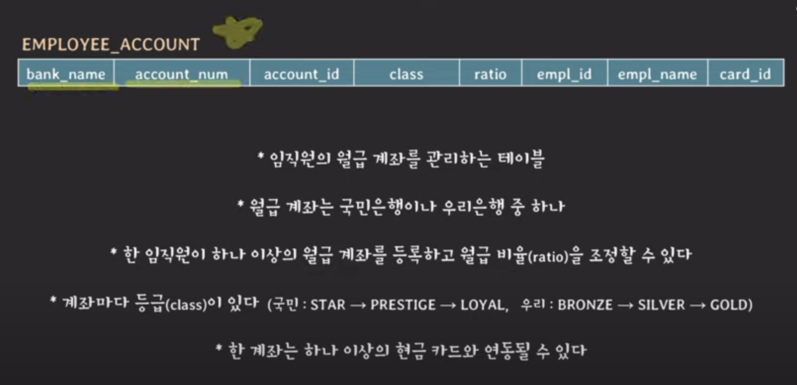
## 1NF
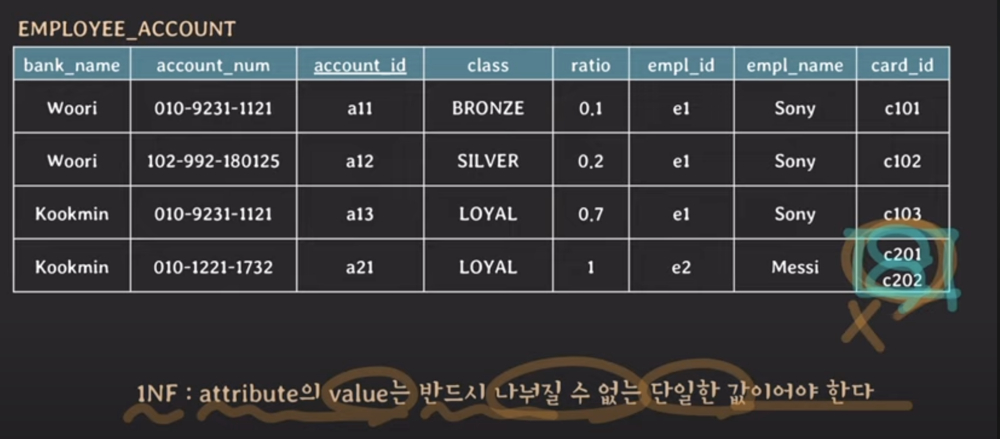
- 어떤 릴레이션에 속한 모든 도메인이 원자 값만으로 되어 있어야한다.
- 모든 속성에 반복되는 그룹이 나타나지 않는다.
- 기본키를 사용하여 관련 데이터의 각 집합을 고유하게 식별할 수 있어야 한다.
  - 데이터베이스 설계에 기본 원칙이기도 하지만 첫 정규형이라 명시된듯 하다.
- 이대로 사용하면 검색하기도 까다로울 것이다. like 구문을 써야할 수도 있다.
## 2NF
모든 컬럼이 완전 함수적 종속이어야 한다.
- 바꿔말하면 부분적 종속이 없어야 한다.
- 복합키가 존재할 때 특히 중요하다. 복합키의 부분집합에 종속적인 애트리뷰트가 있다면 부분적 종속을 가지는 것으로 2차 정규화가 필요할 수 있다.
### 2NF 이전 : 부분 종속 발생
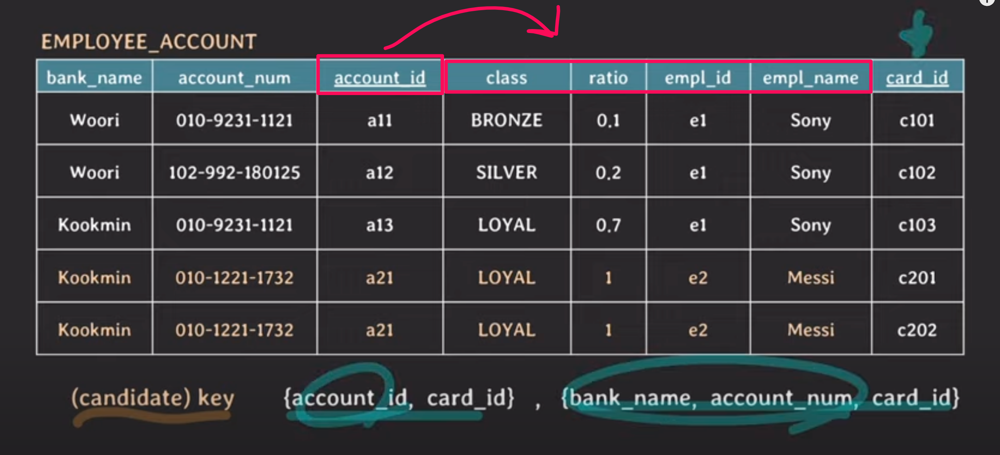
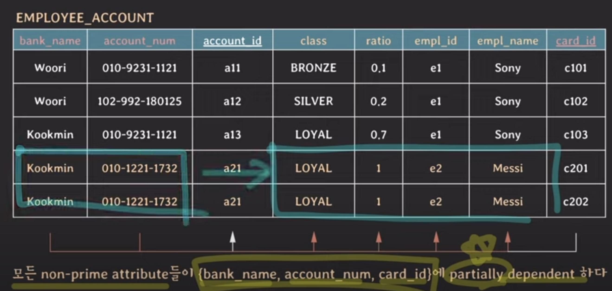
### 2NF 이후
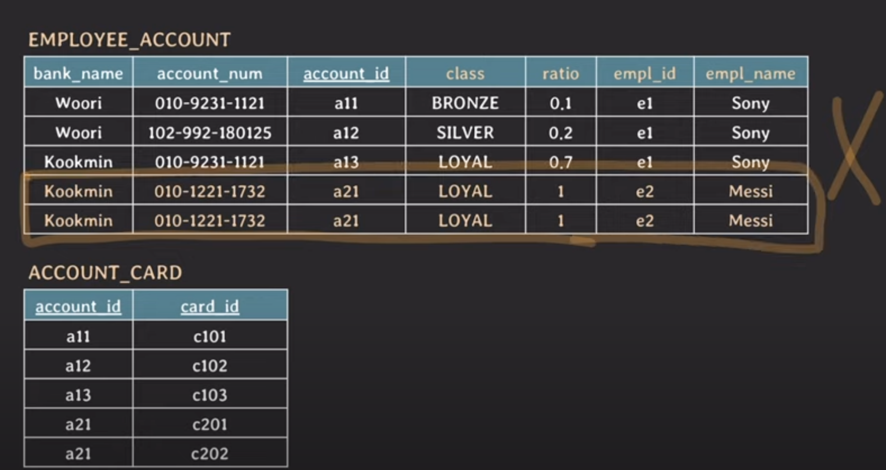

## 3NF
- 이행적 종속의 제거
- X -> Y, Y -> Z 이기때문에 X -> Z와 같이 간접적인 종속 관계가 일어나는 경우를 말한다. 여기서 Y 또는 Z가 어떠한 키의 부분집합도 아니라면  transitive functional dependency을 가진다.
- 바꿔 말하면 non-prime 애트리뷰트 어떤 키에도 이행적 종속을 가지면 안된다는 의미이다.
### 이행 종속 발생
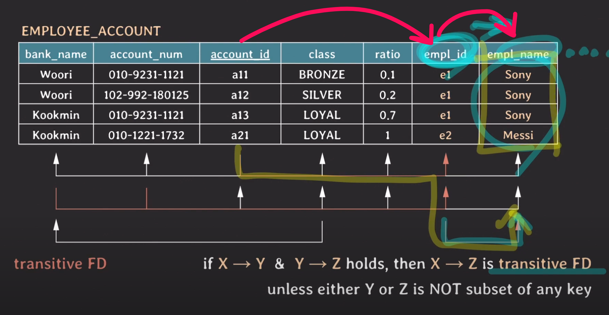
### 이행 종속이 아닌 경우 
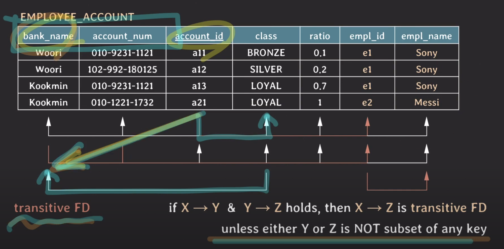
### 3NF 이후
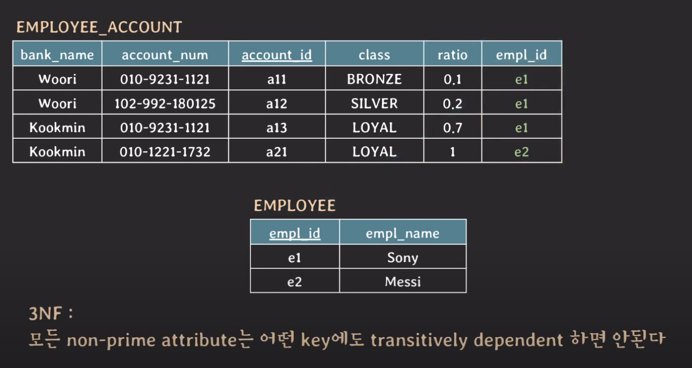
## BCNF
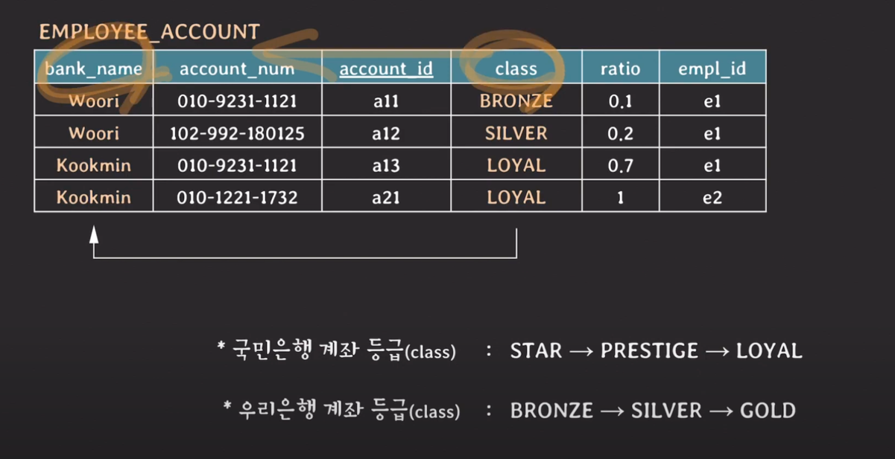
모든 결정자가 후보키 집합에 속해야 한다.
- 여기서 결정자는 다른 속성을 결정짓는 속성이다.
- 즉, 식별자로 쓰이는 속성이 일반 속성에 종속되지 않아야 한다.
- 제3정규화를 통해서도 제거되지 않은 데이터의 중복 문제를 해결해 주기 때문에 일명 ‘제3.5정규화’라고도 부른다.

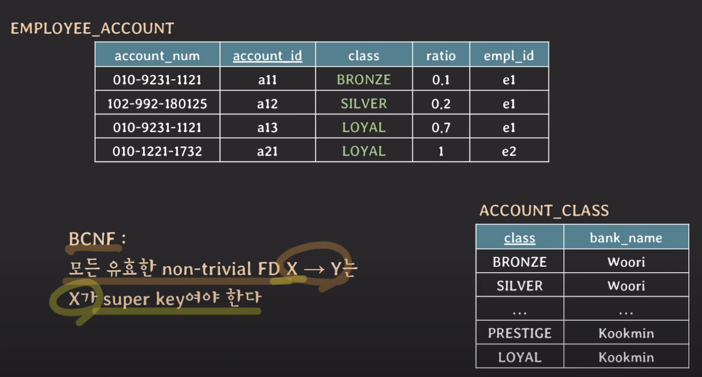
## 4NF
- 다치 종속의 제거
## 참고 및 출처
compsite의 사진자료는 코딩애플 강의에서, 나머지는 쉬운코딩 강의에서 캡쳐했습니다. 코딩 애플님 강의는 간략한 설명이 있고, 쉬운코딩님 강의에는 좀 더 자세한 내용이 쉽게 설명되어 있습니다.
- [코딩 애플 정규화 요약](https://www.youtube.com/watch?v=Y1FbowQRcmI&t=3s)
- [쉬운 코드 정규화 강의](https://www.youtube.com/watch?v=EdkjkifH-m8&list=PLcXyemr8ZeoREWGhhZi5FZs6cvymjIBVe&index=23)
- [gyoogle 정규화](https://gyoogle.dev/blog/computer-science/data-base/Normalization.html) 1,2,3 예시 및 간략한 설명 있다.
