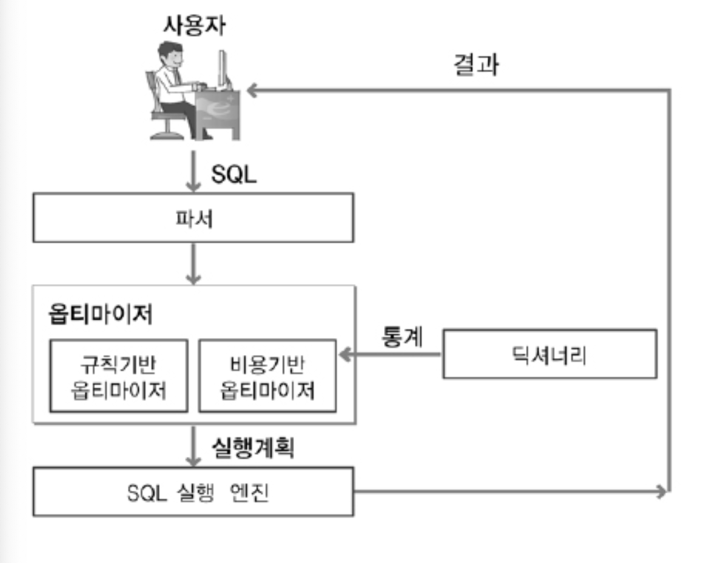

Optimizer
===
### 의미
- SQL을 가장 빠르고 효율적으로 수행할 최적의 처리경로를 생성해 주는 DBMS 내부의 핵심 엔진이다. 
- 사용자가 구조화된 질의어(SQL)로 결과 집합을 요구하면, 이를 생성하는데 필요한 처리경로는 DBMS에 내장된 옵티마이저가 자동으로 생성해준다. 
- 옵티마이저가 생성한 SQL 처리경로를 실행계획(Execution Plan)이라고 한다. 

## 옵티마이저의 목표
(그냥 gpt 답변이니 가볍게 보기) 주된 목적은 SQL을 실행하는데 가장 효율적인 길을 찾는 것이다. 특히 대량의 데이터나 복잡한 쿼리들을 다룰 때,
효율적인 쿼리는 데이터베이스의 전체의 성능에 영향을 끼칠 수 있다.
- 리소스 사용량 최소화
- 처리량 극대화
- 응답 시간 최소화
- 정확성 유지
- 조건들의 변화에 적응 (데이터, 볼륨 변화 등)

## 실행 과정
### 동작

1. 사용자가 던진 쿼리 수행을 위해, 후보군이 될만한 실행계획을 찾는다.
2. 데이터 딕셔너리(Data Dictionary)에 미리 수집해 놓은 오브젝트 통계 및 시스템 통계정보를 이용해 각 실행계획의 예상 비용을 산정한다.
3. 각 실행계획을 비교하여 최저비용을 갖는 하나를 선택한다.

 gpt의 실행 계획 선택 예시

두 테이블을 조인하는 쿼리가 있다고 가정한다.
- Orders 및 Customers라는 두 테이블을 조인하는 쿼리가 있다.
- Orders 테이블에는 수백만 개의 행이 있는 반면 Customers 테이블에는 몇 백 개의 행만 존재
- 즉, 훨씬 큰 Orders가 존재한다.

1. 중첩 루프 조인
- 이 알고리즘은 Orders 테이블의 각 행을 반복하고 각 행에 대해 Customers 테이블을 검색하여 일치하는 행을 찾는다.
- 그러나 Orders 테이블의 크기를 고려할 때 이 접근 방식은 계산 리소스 측면에서 비싸다.

2. 대안, 해시 조인 알고리즘
- 이 알고리즘은 먼저 더 작은 테이블(이 경우 Customers)을 스캔하고 키가 조인 열인 해시 테이블을 메모리에 생성
- 더 큰 테이블(주문)을 스캔하고 각 행에 대해 조인 열의 해시 값을 계산하고 해시 테이블에서 일치하는 행을 찾는다.

옵티마이저는 예상 비용에 따라 중첩 루프 조인 대신 해시 조인 알고리즘을 선택할 수 있다.
- 비용은 테이블의 크기, 사용 가능한 시스템 메모리, 조인 열의 값 분포 등과 같은 요소를 기반으로 추정할 수 있다.
- 이러한 비용 추정을 통해 정확한 최신 통계를 확보하는 것이 DBMS의 성능에 중요한 이유이다.

 해시테이블을 메모리에 퍼올려도 되는거야?

해시 조인도 작은 테이블이라고 가정한 테이블이 예상보다 크면 메모리를 초과할 수 있다. 또한 데이터 분포에 따라, 조인 키의 값이 특정 해시 버킷에 치우쳐 있는 경우, 성능이 저하될 수 있다.
그래서 보통 여러 조인 전략을 지원하며, 옵티마이저는 다양한 요소(테이블 크기, 데이터 분포, 인덱스 유무, 메모리 상태 등)를 고려한다.

단순화된 예시이며, 실제 시나리오에서는 옵티마이저가 인덱스의 존재 여부, 조인의 테이블 순서, 사용 중인 특정 DBMS 등 다른 많은 요소를 고려해야 한다.

### 동작 및 내부 요소들

- Parser : SQL문장을 분석하여 문법 검사와 구성요소를 파악하고 이를 파싱 해서 파싱 트리를 만듭니다.
- Query Transformer : 파싱된 SQL을 보고 같은 결과를 도출하되, 좀 더 나은 실행 계획을 갖는 SQL로 변환이 가능한지를 판단하여 변환 작업을 수행합니다.
- Estimator : 시스템 통계정보를 딕셔너리로부터 수집하여 SQL을 실행할 때 소요되는 총비용을 계산합니다.
- Plan Generator : Estimator를 통해 계산된 값들을 토대로 후보군이 되는 실행계획을 도출합니다.
- Row-Source Generator : 옵티마이저가 생성한 실행계획을 SQL 엔진이 실제 실행할 수 있는 코드나 프로시저 형태로 포맷팅 합니다.
- SQL Engine : SQL을 실행합니다.

## 종류
### 규칙 기반 옵티마이저(RBO)
| 구분   | 세부 통계 정보              |
|--------|-------------------------|
|우선순위|	설명|
|1|	ROWID를 사용한 단일 행인 경우|
|2|	클러스터 조인에 의한 단일 행인 경우|
|3|	유일하거나 기본키(Primary Key)를 가진 해시 클러스터 키에 의한 단일 행인 경우|
|4|	유일하거나 기본키(Primary Key)에 의한 단일 행인 경우|
|5|	클러스터 조인인 경우|
|6|	해시 클러스터 조인인 경우|
|7|	인덱스 클러스터 키인 경우|
|8|	복합 칼럼 인덱스인 경우|
|9|	단일 칼럼 인덱스인 경우|
|10|	인덱스가 구성된 칼럼에서 제한된 범위를 검색하는 경우|
|11|	인덱스가 구성된 칼럼에서 무제한 범위를 검색하는 경우|
|12|	정렬-병합(Sort-Merge) 조인인 경우|
|13|	인덱스가 구성된 칼럼에서 MAX 혹은 MIN을 구하는 경우|
|14|	인덱스가 구성된 칼럼에서 ORDER BY를 실행하는 경우|
|15|	전체 테이블을 스캔(FULL TABLE SCAN)하는 경우|
- 실행 속도가 빠른 순으로 규칙을 먼저 세워두고, 우선순위가 앞서는 방법을 채택한다.
  - 가능하면 인덱스가 사용되어야 한다. 또는 더 작은 테이블이 먼저 조인되어야 한다 등...
- 간단하고 예측 가능하지만, 실제 데이터나 시스템의 현재 상태를 고려하지 못한다.
  - 복잡하거나 대규모일 경우 비효율적인 실행 계획으로 이어질 수 있다. 
  - 오라클 8이하의 버전의 기본값. 과거에는 비용 예측 능력이 그다지 좋지 않아 이 방식을 사용했다.
- 휴리스틱 옵티마이저 
### 비용 기반 옵티마이저(CBO)
- 조건 기반 옵티마이저의 한계를 극복해낸 방식이다. 
- 비용(소요시간, 자원 사용량)이 가장 적게 드는 방식을 택한다.
- 테이블의 행 수, 열의 값 분포, 사용 가능한 인덱스 등 데이터베이스의 데이터에 대한 통계 정보를 사용한다. 정확한 통계정보를 유지하는게 중요하다.
- 비용 기반 옵티마이저는 옵티마이저에서 실행 계획을 세운 뒤(최대 2천개까지) 비용이 최소한으로 나온 실행 계획을 수행

### 휴리스틱 옵티마이저?
- 규칙 기반 옵티마이저 관련이 깊고, 동일하게 보는 경우도 있다.
- 결국 규칙에 기반한다는 사실은 같지만, 규칙을 경험적인 규칙으로 설정한다고 이해된다. 즉, 규칙 기반인데 그 규칙들이 휴리스틱하다면 휴리스틱 옵티마이저로 볼 수 있다.
- 조 회의에서 토의한 결과 분류하기가 모호한 부분이 많았다.

## 주요 통계 정보
통계 정보는 꾸준히 갱신되는 것이 좋다. 스케줄러를 활용하거나 직접 수동으로 통계 정보를 생성하는 방법도 있다.

| 구분   | 세부 통계 정보                                                                                                                                                                                                             |
|--------|----------------------------------------------------------------------------------------------------------------------------------------------------------------------------------------------------------------------|
| 테이블  | 테이블의 전체 행의 갯수 테이블이 차지하고 있는 전체 블록  테이블의 행들이 가지고 있는 평균 길이|
| 컬럼   | 컬럼 값의 종류 컬럼 내부 NULL 값의 분포도 컬럼 값의 평균 길이 컬럼 내부 데이터 분포의 추정치|
| 인덱스  | LEAF BLOCK 수 : 데이터를 보관하는 블록 수 LEVELS : 인덱스 트리의 LEVEL CLUSTERING FACTOR : 접근하고자 하는 데이터가 모여 있는 밀집도|
| 시스템  | I/O 성능 및 CPU 성능 및 사용률|

## 옵티마이저의 한계
- 옵티마이저가 사람이 만든 소프트웨어 엔진에 불과하며 결코 완벽할 수 없음을 이해하는 것은 중요하다.
- 점차 기능이 향상되고 있지만 절대 맹신하지 말자. 
- 비효율적으로 동작하고 있다면 오라클의 힌트와 같은 부가적인 장치로 올바르게 작동하도록 유도해야 한다.

## 참고 및 출처
- 이미지 및 내용 출처 : [코딩팩토리](https://coding-factory.tistory.com/743)
- https://code-lab1.tistory.com/137
- [Optimizer 한계 - 병규님](https://b09y.notion.site/Optimizer-347e7cb2ed3c45fbb6c6e0f313a739b9)