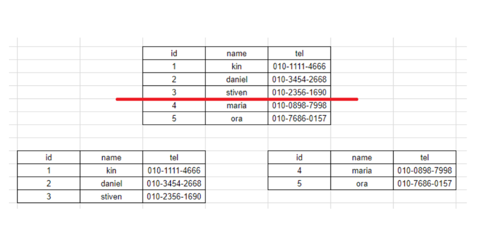
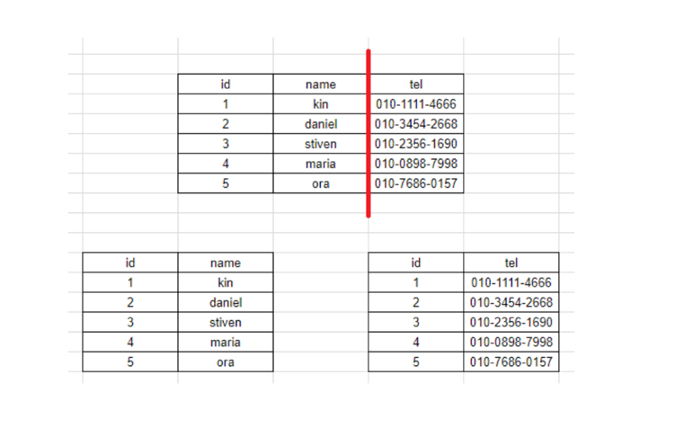
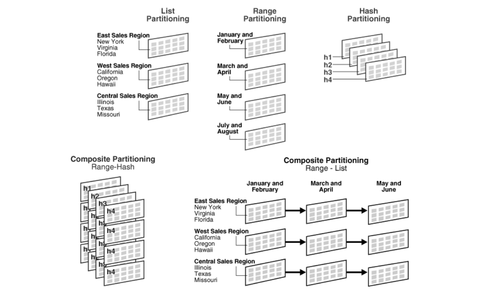

Partitioning
===
## 파티셔닝이란?
- 큰 table이나 index를 관리하기 쉬운 partition이라는 작은 단위로 물리적으로 분할하는 것을 의미한다.
  - 물리적인 데이터 분할을 DB에 접근하는 application의 입장에서는 모른다.
  - 물리적인 분할이란 하드웨어와 관련이 있다는 의미가 아니고 실제의 별도의 물리적인 공간에 저장되는 방식을 가리킨다.
- 소프트웨어적으로 데이터베이스를 분산 처리하여 성능이 저하되는 것을 방지하고 관리를 보다 수월하게 할 수 있게 한다.

## 배경
- 서비스의 크기가 점점 커지고 DB에 저장하는 데이터의 규모 또한 대용량화 되면서, 기존에 사용하는 DB 시스템의 용량(storage)의 한계와 성능(performance)의 저하 발생
- 즉, VLDB(Very Large DBMS)와 같이 하나의 DBMS에 너무 큰 table이 들어가면서 용량과 성능 측면에서 많은 이슈가 발생하게 되었고, 
이런 이슈를 해결하기 위한 방법으로  '파티셔닝(Partitioning)'기법 이 나타나게 되었다.

## 파티셔닝의 목적
### 성능(Performance)
- 특정 DML과 Query의 성능을 향상시킨다.
- 주로 대용량 Data WRITE 환경에서 효율적이다.
- 특히, Full Scan에서 데이터 Access의 범위를 줄여 성능 향상을 가져온다.
- 많은 INSERT가 있는 OLTP 시스템에서 INSERT 작업을 작은 단위인 partition들로 분산시켜 경합을 줄인다.
  - OLTP(Online Transaction Processing) : 데이터베이스의 한 유형으로 대용 사용자가 실시간 트랜잭션을 수행하도록 설계된 시스템을 말한다. 
### 가용성(Availability)
- 물리적인 파티셔닝으로 인해 전체 데이터의 훼손 가능성이 줄어들고 데이터 가용성이 향상된다.
- 각 분할 영역(partition별로)을 독립적으로 백업하고 복구할 수 있다.
- table의 partition 단위로 Disk I/O을 분산하여 경합을 줄이기 때문에 UPDATE 성능을 향상시킨다.
### 관리용이성(Manageability)
- 큰 table들을 제거하여 관리를 쉽게 해준다.
- 각 파티션을 독립적으로 백업 및 복구, 데이터를 쉽게 추가/제거 가능

## 파티셔닝의 장점
### 관리적 측면 : partition 단위 백업, 추가, 삭제, 변경
- 전체 데이터를 손실할 가능성이 줄어들어 데이터 가용성이 향상된다.
- partition별로 백업 및 복구가 가능하다. -> 전체 백업 및 복구보다 빠르고 효율적
- partition 단위로 I/O 분산이 가능하여 UPDATE 성능을 향상시킨다.
### 성능적 측면 : partition 단위 조회 및 DML수행
- 데이터 전체 검색 시 필요한 부분만 탐색해 성능이 증가한다. 필요한 데이터만 빠르게 조회할 수 있기 때문에 쿼리 자체가 가볍다.
- Full Scan에서 데이터 Access의 범위를 줄여 성능 향상을 가져온다.

## 파티셔닝의 단점
- table간 JOIN에 대한 비용이 증가한다.
- table과 index를 같이 파티셔닝해야 한다. -> 인덱스와 같이 파티셔닝 안해도 가능한걸로 보이는데...
- 파티션을 적절히 관리하고 구성하지 않으면 복잡해지고, 데이터 불균형이 발생할 수도 있다.
- 전역 쿼리의 성능이 저하될 수 있다.

## 파티셔닝의 종류
### 수평(horizontal) 파티셔닝

- 일반적으로 말하는 파티셔닝
- 퍼포먼스, 가용성을 위해 KEY 기반으로 여러 곳에 분산 저장한다.
- 샤딩(Sharding) 과 동일한 개념
- 수평 파티셔닝은 테이블을 나누는 것을 말하고, 샤딩은 데이터베이스 또는 서버에 데이터를 분산시키는 것을 의미해서 샤딩이 더 좁은 범위의 포함되는 개념으로 볼 수도 있다.
### 수직(vertical) 파티셔닝

- 컬럼들이 다른 테이블들에 저장
- ex. 자주 접근되는 컬럼들을 한 테이블에 배치하고, 자주 엑세스 하지 않는 열은 다른 테이블에 배치

## 파티셔닝의 분할 기준

### 범위 분할(range partitioning)
- 특정 칼럼 값으로 테이블을 나누는 것을 포함한다.
- 분할 키 값이 범위 내에 있는지 여부로 구분한다.
- 주문 테이블이 주문 날짜로 파티션되어 있다면, 모든 주문들은 특정 같은 연도가 같은 파티션에 넣을 수 있다.
### 목록 분할(list partitioning)
- 특정 행을 특정 파티션에 구체적으로 매핑하려는 경우
- 일반적으로 불연속형 값을 기반으로 한다.
- 고객이 거주하는 도시를 기준으로 고객 테이블을 분할
### 해시 분할(hash partitioning)
- 해시 함수의 값에 따라 파티션에 포함할지 여부를 결정한다.
- 특정 행을 저장할 위치를 결정하기 위해 일부 열 값에 해시 함수를 사용.
- 여러 파티션 데이터를 고르게 분산하는 데 도움이 된다.
- 특정 경우 부하를 분산하는데 유용하다.
### 복합 분할(composite partitioning)
- 다른 분할 방법과 결합
- ex. range-hash partitioning : 범위에 따라 분리하고 더 나아가 해시에 의해 나누어 진다. 거대한 테이블에 유용

## GPT 파티셔닝 예시 코드
- MySQL에서 파티셔닝을 어떻게 쓰는지 물어봤다.
+ 답변 : 간단한 range partitioning 코드
```sql
CREATE TABLE employees (
    id INT NOT NULL,
    fname VARCHAR(30),
    lname VARCHAR(30),
    hired DATE NOT NULL DEFAULT '1970-01-01',
    separated DATE NOT NULL DEFAULT '9999-12-31',
    job_code INT NOT NULL,
    store_id INT NOT NULL
)
PARTITION BY RANGE (store_id) (
    PARTITION p0 VALUES LESS THAN (6),
    PARTITION p1 VALUES LESS THAN (11),
    PARTITION p2 VALUES LESS THAN (16),
    PARTITION p3 VALUES LESS THAN MAXVALUE
);

```
- MySQL에서는 RANGE, LIST, HASH, KEY 등의 파티셔닝 유형을 지원한다.
- MySQL의 경우, 모든 파티션에서 사용 가능한 스토리지 엔진은 InnoDB와 NDB(Cluster) 뿐 이외의 스토리지 엔진은 확인하고 써야한다.

## 참고 및 출처
- [WeareSoft](https://github.com/WeareSoft/tech-interview/blob/master/contents/db.md#%ED%8C%8C%ED%8B%B0%EC%85%94%EB%8B%9D) : 대부분의 내용
- [권희정님 블로그](https://gmlwjd9405.github.io/2018/09/24/db-partitioning.html) : 수직 수평 파티셔닝 정리 잘되어 있다.