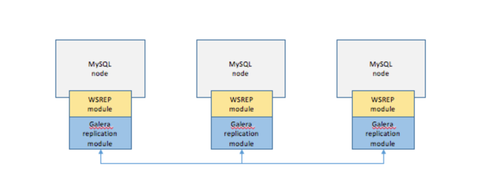

Replication
===

- 실시간 복제본 데이터베이스 서버를 운용하는 것을 의미한다.
  - 한 데이터베이스 서버(마스터/기본)의 데이터를 하나 이상의 서버(슬레이브/보조)에 실시간으로 복제 할 수 있게 한다.
  - 복제본은 소스에서 업데이트를 받기 위해 영구적으로 연결할 필요가 없다.
- 여러 개의 DB를 권한에 따라 수직적인 구조(Master-Slave)로 구축한다.

## 특징
- 쓰기와 읽기는 master에서 이루어져야 하지만 읽기는 하나 이상의 복제본에서 수행될 수 있다.
- 비동기 방식으로 노드들 간의 데이터를 동기화한다.
  - 쓰기 작업 완료 -> 다음 쓰기 작업이 복제본으로 전송 -> 기본 데이터베이스는 다음 작업으로 넘어가기 전 복제본의 승인을 기다리지 않는다.
  - 동기 방식이면 네트워크 왕복 시간을 기다려야 한다.
- master에 쓰기가 일어나면 log에 변경사항이 기록되고, 복제본의 master 데이터베이스에 연결된 I/O 쓰레드가 실시간으로 읽고 복제한다.
## 장단점
### 장점
- DB 요청의 60~80% 정도가 읽기 작업이다. 읽기 작업의 분리로 성능을 높일 수 있다.
- 부하를 분산할 수 있다.
- 비동기 방식으로 운영되어 지연 시간이 거의 없다.
### 단점
- 노드들 간의 데이터 동기화가 보장되지 않아 일관성있는 데이터를 얻지 못할 수 있다.
- master가 다운되면 복구 및 대처하기 까다롭다.
- 적용한 데이터 변경사항이 slave에 반영될때까지 일정 시간이 걸린다. 순간적 데이터의 불일치가 발생할 수 있다.

# Clustering

- 여러 개의 DB를 수평적인 구조로 구축하는 방식
- Single point of failure 같은 문제 해결하는 Fail Over 시스템을 구축하기 위해 사용. 고가용성 환경을 만드는 데 사용.
  - SPOF는 전체 시스템을 멈추게 하는 구성 요소나 시스템의 일부를 말한다. 고가용성이나 안정성을 고려할때 당연히 바람직하지 못하다.
  - fail over는 장애조치에 대한 이야기. 장애 발생 시 백업 노드를 활용하는 등 방법의 있다.
- 클러스터에서는 일반적으로 모든 노드가 공통 데이터/저장소 집합에 대한 액세스를 공유한다.
- 한 노드에 장애가 발생하면 클러스터의 다른 노드가 해당 노드의 워크로드를 이어받을 수 있다.
## 특징
- 동기화 방식을 사용한다. 데이터를 복제한 후 결과를 확인하기 때문에 데이터 누락이 발생하지 않는다.
- 어느 한쪽이 다운되어도 시스템을 계속 운영 가능하다.

## 장단점
### 단점
- 노드들 간의 데이터 동기화를 통해 항상 일관성 있는 데이터를 얻는다.
- 1개의 노드가 다운되어도 다른 노드가 살아 있어 시스템을 장애없이 운영 가능하다.
### 단점
- 모든 노드에 데이터 복제 요청을 해야해서 Replication에 비해 쓰기 성능이 떨어진다.
- 장애가 전파될 수 있다. 장애 상황인 노드의 응답을 대기하다가 문제가 생길 수도 있다.
- 데이터 동기화에 의해 스케일링에 한계가 있다.

## 참고 및 출처
- https://mangkyu.tistory.com/97
- http://www.mysqlkorea.com/gnuboard4/bbs/board.php?bo_table=community_03&wr_id=1504
- (MySQL 공식 문서) [https://dev.mysql.com/doc/refman/8.0/en/replication.html]
- https://mangkyu.tistory.com/97