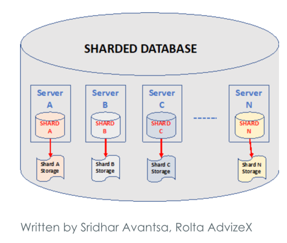

Sharding
===

- 물리적으로 다른데이터 베이스에 수평 분할 방식으로 분산 저장하고 조회하는 방법
- 데이터의 볼륨이 커지고, 많은 사용자가 많아지면서 발생하는 병목현상을 해결한다. 샤드라고 하는 더 작은 조각으로 분할하여 여러 데이터베이스 서버에 저장으로써 이를 극복한다.
- 데이터베이스와 연결하는 것은 샤딩 플랫폼이 할 일이며, 애플리케이션 서버에서 어떤 데이터가 어떤 데이터베이스에 위치에 있는지 알 필요가 없다.

## 샤드란?
- 독립적으로 운영될 수 있는 별도의 데이터베이스이다.
- 각자 다른 물리적 또는 가상 서버에 배치될 수 있다.
- 데이터 분산을 허용하고 동시에 여러 샤드에 걸쳐 질의를 수행한다.

### 논리적 샤드, 물리적 샤드
- 분할된 데이터 청크를 논리적 샤드라고 한다.
- 논리적 샤드를 저장하는 시스템을 물리적 샤드 혹은 데이터베이스 노드라고 한다.
- 데이터베이스 샤딩은 비공유 아키텍처를 기반으로 작동한다. 각 물리적 샤드는 독립적으로 작동하며 다른 샤드를 인식하지 못한다.
### 샤드 키
- 샤딩된 데이터베이스의 서로 다른 부분(샤드)에 분배하는 데 사용되는 기준. 개발자는 샤드 키를 사용하여 데이터 세트를 분할하는 방법을 결정한다.
- 데이터 세트의 열은 함께 그룹화되어 샤드를 구성하게 될 데이터 행을 결정한다. 

## 이점
- 응답 시간 개선
- 전체 서비스 중단 방지
- 효율적인 크기 조정

## 종류
### 범위 기반 샤딩
- 값의 범위에 따라 데이터베이스 행을 분할한다.
- 상대적으로 구현이 쉽다.
- 디스크 사용량이나 쿼리 처리량의 밸런스가 많이 안맞는 경우가 발생 가능하다. 데이터 값에 따라 단일 물리적 노드에서 데이터가 오버로드될 수 있다. 
### 해시 샤딩
- 해시 함수를 이용해 각 행에 샤드 키를 할당한다.
- 해시 값을 샤드 키로 사용하고 해당하는 물리적 샤드에 정보를 저장한다.
- 물리적 샤드 간에 데이터를 고르게 분산하지만, 정보의 의미에 따라 데이터베이스를 분할하지는 않는다.
- 물리적 샤드를 추가할 때 해시 값을 재할당하기 어려울 수 있다.
### 디렉터리 샤딩
- 조회 테이블을 사용하여 데이터베이스 정보를 해당하는 물리적 샤드와 매칭한다. 정보를 조회할 때 조회 테이블을 활용한다.
- 각 샤드는 데이터베이스의 의미 있는 표현이며 범위에 의해 제한되지 않는다. 
- 조회 테이블에 잘못된 정보가 포함되어 있으면 디렉터리 샤딩이 실패한다.
### 지리적 샤딩
- 지리적 위치에 따라 정보를 분할하고 저장한다. 데이팅 서비스 웹 사이트를 생각해보자.
- 데이터가 고르지 않게 분산될 수 있다.

### Modulus 방식 
- [ID값] % [샤드 개수] 
- 샤드 추가가 어렵다. 샤드가 많으면 낭비가 클 수 있다.

## Replication, Sharding, Partitioning 구분

gpt : 세 개를 언제 사용해?

이 세 가지 기술은 각각 데이터베이스 성능 향상을 위해 사용되지만, 주로 다음과 같은 상황에서 사용된다.
### Replication
- 가용성을 높이고자 할 때
- 읽기 쿼리에 대한 부하를 분산
### Sharding
- 데이터를 여러 노드(보통 데이터베이스 서버)에 분산시켜 각 노드가 처리해야 할 데이터의 양을 줄여 성능을 향상시킨다.
- 큰 규모의 데이터를 다루고 있고, 단일 노드에서의 용량이나 성능 한계에 도달했을 때 주로 사용
### Partitioning (파티셔닝):
- 파티셔닝은 하나의 테이블을 논리적으로 작은 파티션으로 나눈다. 관리를 쉽게 하고 성능을 향상시킨다.
- 특정 테이블이 너무 커져서 관리가 어렵거나 성능 저하를 일으킬 때 주로 사용

### 클러스터, 노드란?
- 여러 컴퓨터 또는 서버가 하나의 단일 시스템처럼 동작하도록 구성된 그룹
- 클러스터에서 각 컴퓨터 또는 서버를 '노드'(node)라고 부른다.

## 참고 및 출처
- https://d2.naver.com/helloworld/14822
- 레인지, 모듈러 샤딩
  - https://techblog.woowahan.com/2687/
  - https://tech.kakao.com/2016/07/01/adt-mysql-shard-rebalancing/
- [aws 샤딩 정리](https://aws.amazon.com/ko/what-is/database-sharding/) : 샤딩 종류 및 예시 정리되어 있다.
- https://medium.com/@nishantparmar/distribute-data-replication-partitioning-and-sharding-920a71481c1c