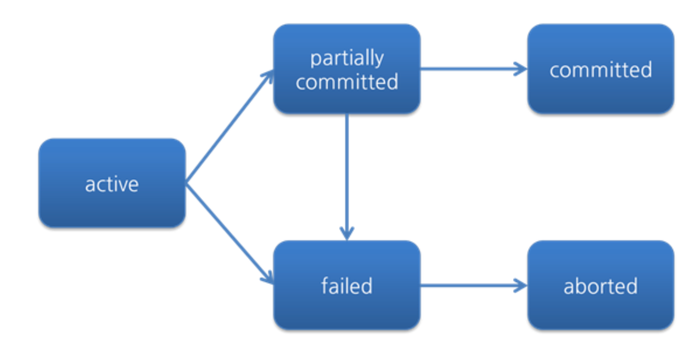

Transaction
===
## 트랜잭션(Transaction) 이란?
- 데이터베이스의 상태를 변환시키는 하나의 논리적인 작업 단위를 구성하는 연산들의 집합이다.
- 상태를 변화시킨다는 것은 SQL 질의어를 통해 데이터베이스에 접근하고 변경하는 것을 생각하면 된다.

## 트랜잭션 예시
예를들어, A계좌에서 B계좌로 일정 금액을 이체한다고 가정하자. 외부에서 보기에는 단순하게 금액이 이동하는 것처럼 보이지만,
프로그래머 입장에서 보면 여러 과정들이 합쳐진 결과이다.
1. A계좌의 잔액을 확인한다.
2. A계좌의 금액에서 이체할 금액을 빼고 다시 저장한다.
3. B계좌의 잔액을 확인한다.
4. B계좌의 금액에서 이체할 금액을 더하고 다시 저장한다.

- 1~4까지 이러한 과정들이 모두 합쳐져 계좌이체라는 하나의 작업단위를 구성한다.
- SELECT, INSERT 등의 질의어로 DB에 접근할텐데, 여러 명령문들의 사람의 사용 기준에 맞춰 작업 단위를 정하는 것이다.

만약 여기서 2번과정을 진행하고 중간에 작업이 종료된다면 어떻게 될까? 사용자는 분명 A계좌에서 B 계좌로 이체를 했는데,
A에서 돈만 차감되고 B에는 돈이 들어오지 않을 것이다. 이런 경우를 방지하기 위해 트랜잭션이라는 논리적 단위를 만들어주는 것이다.

참고로 하나의 트랜잭션은 Commit 되거나 Rollback 된다.

### Commit 연산
- 하나의 트랜잭션에 대한 작업이 성공적으로 끝나 데이터베이스가 다시 일관된 상태에 있을 때, 
이 트랜잭션이 행한 갱신 연산이 완료된 것을 트랜잭션 관리자에게 알려주는 연산이다.
- 예시에서 1~4가 성공적으로 실행된다면, Commit 연산이 실행된다.
### Rollback 연산
- 하나의 트랜잭션 처리가 비정상적으로 종료되어 데이터베이스의 일관성을 깨뜨렸을 때,
이 트랜잭션의 일부가 정상적으로 처리되었더라도 트랜잭션의 원자성을 구현하기 위해 이 트랜잭션이 행한 모든 연산을 취소(Undo)하는 연산이다.
- Rollback 시에는 해당 트랜잭션을 재시작하거나 종료한다.
- 아까 예시로 든, 2번 과정까지 진행 후 비정상적으로 종료되는 경우, 해당 변경 사항을 폐기하거나 재시작한다.
B계좌에 돈이 안들어왔는데, A계좌만 차감된다면 문제가 될 것이다. 그래서 원래 상태(A계좌에 돈이 빠져나가기 전)으로 돌려놓는 것이다.

데이터베이스 응용 프로그램은 트랜잭션들의 집합으로 정의할 수 있다.

## 트랜잭션의 성질(ACID)
### 원자성(Atomicity), All or nothing
트랜잭션의 모든 연산들은 정상적으로 수행 완료되거나 아니면 전혀 어떠한 연산도 수행되지 않은 상태를 보장해야 한다.
### 일관성(Consistency)
트랜잭션 완료 후에도 데이터베이스가 일관된 상태로 유지되어야 한다.
### 독립성(Isolation)
하나의 트랜잭션이 실행하는 도중에 변경한 데이터는 이 트랜잭션이 완료될 때까지 다른 트랜잭션이 참조하지 못한다.
- Isolation 성질을 보장할 수 있는 가장 쉬운 방법은 모든 트랜잭션을 순차적으로 수행하는 것이다. 
- 하지만 병렬적 수행의 장점을 얻기 위해서 DBMS는 병렬적으로 수행하면서도 일렬(serial) 수행과 같은 결과를 보장할 수 있는 방식을 제공하고 있다.
### 지속성(Durability)
성공적으로 수행된 트랜잭션은 영구적으로 반영되어야 한다.

## 필요성
- 현금 인출기를 작동하는 도중에 기계오류나 정전 등과 같은 예기치 않은 상황이 발생하여 카드가 나오지 않거나 기계가 멈추는 경우
- 각각 다른 지점의 은행에서 동시에 인출할 때, 하나의 지점이 다른 지점에서 저장한 잔액을 덮어 쓰는 경우

## 트랜잭션의 상태

*트랜잭션 상태 다이어그램(Silberschatz 외, 2010)*

### 활동(Active)
트랜잭션이 시작되면 활동 상태가 된다. 트랜잭션이 실행 중에 있는 상태, 연산들이 정상적으로 실행 중인 상태
### 장애(Failed)
트랜잭션이 실행에 오류가 발생하여 중단된 상태
### 철회(Aborted)
트랜잭션이 비정상적으로 종료되어 Rollback 연산을 수행한 상태. 
### 부분 완료(Partially Committed)
트랜잭션이 마지막 연산(문장)까지 실행했지만, Commit 연산이 실행되기 직전의 상태
### 완료(Committed)
트랜잭션이 성공적으로 종료되어 Commit 연산을 실행한 후의 상태. 영구적으로 반영된다.

## 참고 및 출처
- [gyoogle 트랜잭션](https://gyoogle.dev/blog/computer-science/data-base/Transaction.html)
- [WeareSoft 트랜잭션](https://github.com/WeareSoft/tech-interview/blob/master/contents/db.md#%ED%8A%B8%EB%9E%9C%EC%9E%AD%EC%85%98%EC%9D%B4%EB%9E%80) 

