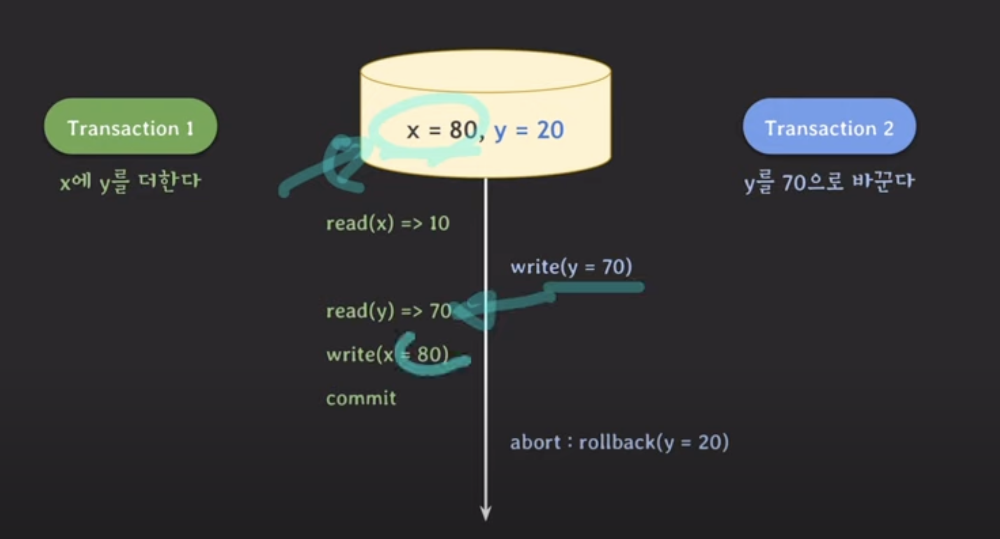
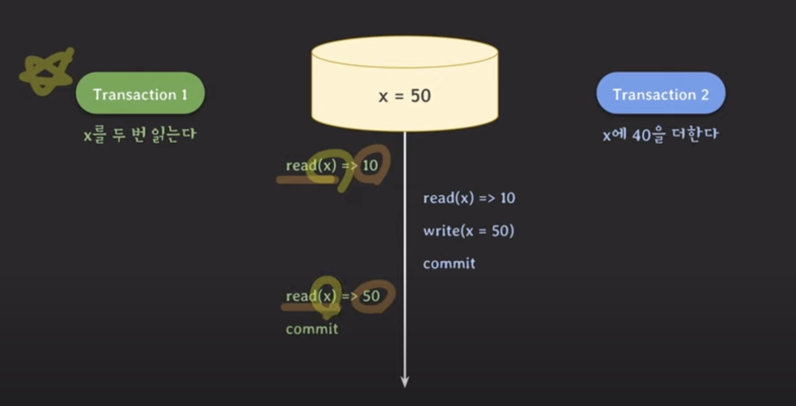

# 트랜잭션 격리 수준 Transaction_Isolation_Level

## 요약 및 의미

- 트랜잭션에서 일관성 없는 데이터를 허용하도록 하는 수준
- DBMS에서 다수의 트랜잭션이 동시에 수행될 때, 한 트랜잭션에서 처리 중인 데이터를 다른 트랜잭션이 볼 수 있는지 허용 여부를 정의한다.

## 필요성

- ACID에서 배웠듯이, 데이터베이스에서는 트랜잭션이 독립적인 수행을 한다.
- 트랜잭션을 처리할 때 무조건적 locking을 적용하고, 순차적으로 수행한다면 dirty read 등의 이상현상들을 모두 없앨 수 있다.
- 하지만 무조건적인 locking을 하다보면 제약사항이 많아져서 동시에 처리 가능한 트랜잭션 수가 줄어들고, 성능이 현저히 떨어질 것이다.
- 그렇다고 locking 범위를 너무 줄인다면, 예상치 못한 동작을 할 수 있다.
- 효율적인 locking 방법이 필요하다. 그래서 일부 이상 현상을 허용하는 level을 만들어서 사용자가 선택하도록 한다.

## 이상 현상

### dirty read



- 트랜잭션 수행 중간에 수행하다 롤백된 다른 트랜잭션의 연산의 영향을 받아서 값이 바뀐다.
- 때문에 다른 값이 읽혀서 다른 값이 write 되었다.
- 즉, 커밋되지 않은 변화를 읽은 것이다.

### repeatable read



- 두 번 읽는데 중간에 커밋된 값 때문에 각각 다른 값을 가져온다.
- 같은 데이터를 조회했지만, 값이 달라진다.

### phantom read


- 한 트랜잭션은 특정 조건을 만족하는 데이터를 두 번 읽는다.
- 해당 트랜잭션이 수행되는 동안 다른 트랜잭션이 값을 추가해서 읽히는 데이터가 많아진다.

## 용어

### Shared Lock (공유 잠금)

- 리소스를 다른 사용자가 동시에 **읽을 수 있게 하지만 변경은 불가**하게 하는 것
- 주로 읽기에 사용
- 어떤 자원에 shared lock이 동시에 여러 개 걸릴 수 있다.
- shared lock이 하나라도 걸려있으면 exclusive lock을 걸 수 없다.
- `FOR SHARE` 구문

### Exclusive Lock (배타적 잠금)

- 어떤 트랜잭션에서 데이터를 변경하고자 할때, 해당 트랜잭션 완료까지 해당 테이블 혹은 레코드를 **다른 트랜잭션에서 읽거나 쓰지 못한다.**
- 주로 쓰기에 사용
- exclusive lock이 걸리면 shared lock, exclusive lock 둘다 추가로 걸 수 없다.
- ex) `FOR UPDATE` 구문
- `UPDATE`, `INSERT`, `DELETE`는 기본적으로 4개의 격리 수준에서 모두 베타적 락의 성질을 가진다.

## 종류

### Read Uncommitted (레벨 0)

- 트랜잭션에 아직 커밋되지 않은 데이터의 조회를 허용한다.
- 데이터베이스의 일관성을 유지할 수 없다.
- 이전 버전의 데이터(rollback되기 이전의 값)가 조회될 수 있다. (dirty read) 이를 제외하면 READ COMMITED와 같다.

### Read Committed (레벨 1)

- 트랜잭션 내에서의 변경이 완료되고 커밋된 데이터만 다른 트랜잭션에서 조회할 수 있다.
- 조회 시에 **각 쿼리**는 **해당 쿼리의 실행 시점**의 커밋된 데이터를 읽는다.

### Repeatable Read (레벨 2)

- MySQL InnoDB의 dafault 값이다.
- 일관된 읽기(Consistent Read)를 위해 MVCC(Multi-Version Concurrency Control)를 사용하여 데이터의 스냅샷을 읽는다.
  - 즉, 모든 조회가 **트랜잭션이 시작할 때**의 스냅샷을 기반으로 데이터를 읽는다.
  - 트랜잭션이 범위 내에서 조회한 데이터의 내용이 항상 동일함을 보장한다.
  - 트랜잭션 동안 다른 트랜잭션에서 수행한 업데이트를 볼 수 없다.

#### 다른 트랜잭션이 해당 트랜잭션의 데이터에 접근/수정을 못한다?

- Repeatable Read는 일관된 읽기에 초점을 맞춘다.
- 현재 트랜잭션의 일관된 조회 결과를 보장하는 것이지, 데이터 수정 자체를 막지 않는다.
- "진행중인 트랜잭션의 데이터 수정을 막을 것인가?"는 락의 종류(낙관적 락과 비관적 락)에 따라 달라진다.

### Serializable (레벨 3)

- 트랜잭션이 시작되는 순간부터 종료될 때까지 트랜잭션에 의해 접근되는 모든 데이터에 대해 shared lock을 설정한다.
- 이상현상 자체가 아예 발생하지 않는다. 완벽한 읽기 일관성 모드를 제공한다.
- 대신 동시 처리 능력이 떨어지고, 성능이 저하된다. 동시성이 중요한 데이터베이스의 경우 거의 사용되지 않는다.

#### InnoDB에서의 동작

- Repeatable Read와 비슷하지만, 자동 커밋이 비활성화되어 있는 경우 InnoDB는 모든 일반 SELECT 문을 암시적으로 SELECT ... FOR SHARE로 변환한다.
- 자동 커밋이 활성화된 경우 SELECT는 자체 트랜잭션이다. (SELECT 쿼리가 시작되고 종료될 때마다 자동으로 커밋)

### 격리 수준 별 이상현상 발생

| 트랜잭션 격리 수준 | Dirty Read | Repeatable Read | Phantom Read |
| ------------------ | ---------- | --------------- | ------------ |
| Read Uncommitted   | O          | O               | O            |
| Read Committed     | X          | O               | O            |
| Repeatable Read    | X          | X               | O            |
| Serializable       | X          | X               | X            |

### level 선택에 고려

- 먼저 말했듯이, Isolation level 조정은 동시성이 증가되는데 반해 데이터 무결성에 문제가 발생할 수 있고, 데이터의 무결성을 유지하는 데 반해 동시성이 떨어질 수 있다.
- 레벨이 높아질수록 비용이 높아진다.

####

<details><summary><b>DB들의 default 격리 수준</b></summary>
<div>

- MySQL InXDB: REPEATABLE READ
- PostgreSQL: READ COMMITTED
- Oracle: READ COMMITTED
- SQL Server: READ COMMITTED
</div>
</details>

### Undo Log

- Undo 로그는 트랜잭션 도중의 개별 데이터 변경 사항을 추적한다.
- 트랜잭션이 수행하는 변경 사항을 원래 상태로 되돌릴 수 있는 정보를 기록하는 로그
- 트랜잭션 실패, Rollback시에 활용
- 해당 트랜잭션 내에서 발생한 데이터 변경에 대해 롤백을 가능하게 하는 것에 중점을 두기 때문에, 삭제나 삽입한 데이터를 기록 안하기도 한다.

### Snapshot

- 데이터베이스 스냅샷은 트랜잭션의 시작 시점의 데이터베이스 상태를 나타낸다.
- REPEATABLE READ 이상인 경우, 트랜잭션은 트랜잭션이 시작될 때 찍은 스냅샷을 바탕으로 데이터를 읽는다.

## 오류 수정 후의 정리

- 격리 수준과 lock의 개념을 분리하지 못해서 이해를 제대로 하지 못하고 넘어갔었다.
- 개인적인 생각에 결과적으로 트랜잭션 격리 수준이란, "트랜잭션이 어떤 상태일때 조회를 허용하는가" 정도의 이야기로 보인다. 물론 마지막 Serializable에서는 자동으로 조회에 공유락이 걸리긴 한다.
- 여기서 격리 레벨과 별개로 비관적 락이냐 낙관적이냐를 결정한다.
- 기본적으로 UPDATE, DELETE, INSERT는 모든 격리 레벨에서 해당하는 레코드에 Exculsive Lock을 건다.

예시로, JPA를 쓸때, @Lock 어노테이션으로,

```java
@Lock(LockModeType.PESSIMISTIC_WRITE)
@Lock(LockModeType.OPTIMISTIC)
```

- 비관적 락을 사용하면 쿼리문에 FOR UPDATE가 사용된다.
- 낙관적 락을 사용하고 version을 추가하면, update시에 쿼리에서 조건문으로 version을 확인한다.

## 참고 및 출처

- 사진 자료 : [쉬운 코드님 강의 영상](https://www.youtube.com/watch?v=bLLarZTrebU&t=439s)
- https://mangkyu.tistory.com/299
- https://dev.mysql.com/doc/refman/8.0/en/innodb-transaction-isolation-levels.html
- https://dev.mysql.com/doc/refman/8.0/en/innodb-consistent-read.html
