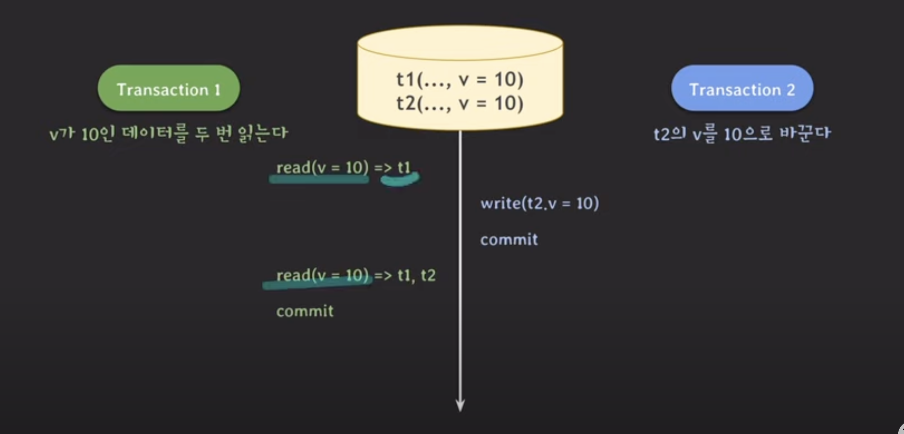

트랜잭션 격리 수준 Transaction_Isolation_Level
===
트랜잭션에서 일관성 없는 데이터를 허용하도록 하는 수준 

## 필요성
- ACID에서 배웠듯이, 데이터베이스에서는 트랜잭션이 독립적인 수행을 한다. 
- 트랜잭션을 처리할 때 무조건적 locking을 적용하고, 순차적으로 수행한다면 dirty read 등의 이상현상들을 모두 없앨 수 있다.
- 하지만 무조건적인 locking을 하다보면 제약사항이 많아져서 동시에 처리 가능한 트랜잭션 수가 줄어들고, 성능이 현저히 떨어질 것이다.
- 그렇다고 locking 범위를 너무 줄인다면, 예상치 못한 동작을 할 수 있다.
- 효율적인 locking 방법이 필요하다. 그래서 일부 이상 현상을 허용하는 level을 만들어서 사용자가 선택하도록 한다.

## 이상 현상
### dirty read

- 트랜잭션 수행 중간에 수행하다 롤백된 다른 트랜잭션의 연산의 영향을 받아서 값이 바뀐다.
- 때문에 다른 값이 읽혀서 다른 값이 write 되었다.
- 즉, 커밋되지 않은 변화를 읽은 것이다.
### repeatable read

- 두 번 읽는데 중간에 커밋된 값 때문에 각각 다른 값을 가져온다.
- 같은 데이터를 조회했지만, 값이 달라진다.
### phantom read

- 한 트랜잭션은 특정 조건을 만족하는 데이터를 두 번 읽는다.
- 해당 트랜잭션이 수행되는 동안 다른 트랜잭션이 값을 추가해서 읽히는 데이터가 많아진다.

## 용어
### Shared Lock (공유 잠금)
- 리소스를 다른 사용자가 동시에 **읽을 수 있게 하지만 변경은 불가**하게 하는 것
- 주로 읽기에 사용
- 어떤 자원에 shared lock이 동시에 여러 개 걸릴 수 있다.
- shared lock이 하나라도 걸려있으면 exclusive lock을 걸 수 없다.
### Exclusive Lock (배타적 잠금)
- 어떤 트랜잭션에서 데이터를 변경하고자 할때, 해당 트랜잭션 완료까지 해당 테이블 혹은 레코드를 **다른 트랜잭션에서 읽거나 쓰지 못한다.**
- 주로 쓰기에 사용
- exclusive lock이 걸리면 shared lock을 걸 수 없다.
- exclusive lock에 걸린 테이블, row에 대해 다른 트랜잭션이 exclusive lock을 걸 수 없다.

정리하면 shared lock끼리만 동시에 여러 개 걸릴 수 있다.

## 종류
### Read Uncommitted (레벨 0)
- 트랜잭션에 처리중인 혹은 아직 커밋되지 않은 데이터를 다른 트랜잭션이 읽는 것을 허용한다.
  - 쓰기 작업에 대해서만 exclusive lock이 걸린다. 
  - SELECT 문장이 수행되는 동안 해당 데이터에 Shared Lock이 걸리지 않는다.
- 중간에 에러가 생겨서 rollback된 값을 commit전에 접근해서 에러가 발생할 수 있다. (dirty read)
- 데이터베이스의 일관성을 유지할 수 없다.

### Read Committed (레벨 1)
- 트랜잭션이 수행되는 동안 다른 트랜잭션이 접근할 수 없어 대기하게 됨
  - SELECT 문장이 수행되는 동안 (개별 쿼리의) 해당 데이터에 shared lock이 걸린다.
  - INSERT, UPDATE, DELETE 같은 쓰기 작업은 exclusive lock이 걸린다.
- 트랜잭션이 수행되는 동안 다른 트랜잭션이 접근할 수 없어 대기하게 된다. 트랜잭션 완료된 데이터만 조회 가능.
- 어떤 사용자가 데이터를 변경하는 동안 다른 사용자는 해당 데이터에 접근할 수 없다.
- 커밋되기 전에는 언두로그에 있는 곳의 데이터를 읽어온다.
  - 언두로그 → 뭔가 잘못되면 돌려야돼서 임시로 저장하는 공간
### Repeatable Read (레벨 2)
- 트랜잭션이 완료될 때까지 SELECT 문장이 사용하는 **모든 데이터**에 Shared Lock이 걸린다.
- 트랜잭션이 범위 내에서 조회한 데이터의 내용이 항상 동일함을 보장한다.
- 따라서, 다른 사용자는 그 영역에 해당되는 데이터에 대한 수정이 불가능하다.

- 커밋 전에 불러오면 가져오는 값이 없고, 커밋 후에 불러오면 가져오는 값이 있어서 정합성이 어긋난다?
### Serializable (레벨 3)
- 동시성이 중요한 데이터베이스의 경우 거의 사용되지 않는다.
- 트랜잭션이 완료될 때까지 SELECT 문장이 사용하는 모든 데이터에 Shared Lock이 걸린다.
- 데이터베이스의 모든 행에 대해 트랜잭션 도중 읽기 및 쓰기 연산이 일어날 때마다 lock을 설정
- 다른 사용자는 해당 영역에 해당되는 데이터에 대한 수정 및 입력이 불가능하다.
- 완벽한 읽기 일관성 모드를 제공한다.
- 따라서 동시 처리 능력이 떨어지고, 성능이 저하된다.
- 이상현상 자체가 아예 발생하지 않는다.

### 격리 수준 별 이상현상 발생
| 트랜잭션 격리 수준 | Dirty Read | Repeatable Read | Phantom Read |
|-------------------|------------|-----------------|--------------|
| Read Uncommitted  | O          | O               | O            |
| Read Committed    | X          | O               | O            |
| Repeatable Read   | X          | X               | O            |
| Serializable      | X          | X               | X            |

### level 선택에 고려
- 먼저 말했듯이, Isolation level 조정은 동시성이 증가되는데 반해 데이터 무결성에 문제가 발생할 수 있고, 데이터의 무결성을 유지하는 데 반해 동시성이 떨어질 수 있다.
- 레벨이 높아질수록 비용이 높아진다.

### 

<b>DB들의 default 격리 수준</b>

- MySQL InXDB: REPEATABLE READ
- PostgreSQL: READ COMMITTED
- Oracle: READ COMMITTED
- SQL Server: READ COMMITTED
- 

### +
- lock에 대한 이해도가 낮아서 이해가 힘들었다. 후에 공부해보자.

## 참고 및 출처
- 사진 자료 : [쉬운 코드님 강의 영상](https://www.youtube.com/watch?v=bLLarZTrebU&t=439s)