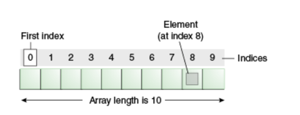

Array
=======
- 배열은 같은 타입의 데이터를 순차적으로 저장하는 데이터 구조
- 데이터를 순차적으로 저장하고 접근해야 하는 경우에 주로 사용된다.
- 많은 데이터를 다루는 경우 효율적인 프로그래밍이 가능하다.
####


사진 출처 : [오라클 공식 문서](https://docs.oracle.com/javase/tutorial/java/nutsandbolts/arrays.html)


## 배열의 특징
- 고정된 크기를 가진다.
  - 생성 시에 배열의 크기를 지정
  - 크기 변경 불가
- 각 요소는 인덱스 또는 키를 사용하여 접근 가능
  - 인덱스는 보통 0에서 시작해서 (길이 - 1)까지의 정수로 이루어진다. (0 ~ n-1)
  - 직접 접근(Random Access)이 가능하다.
- 같은 타입의 데이터를 저장한다.
  - 물론 일부 언어에서는 다양한 타입 요소를 사용 가능하다.

## 장단점
### 장점
- 메모리에 연속적으로 저장하므로 효율적으로 메모리를 사용한다.
- 직접 접근 가능해서 빠르다.
- 간단하고 직관적이다.

### 단점
- 고정된 크기를 가지기 때문에 가득차면 새로운 요소를 추가할 수 없으며, 
배열의 크기가 크면 메모리가 낭비될 수 있다.
- 추가 및 삭제하려면 다른 요소를 이동시켜야해서 불리하다.
- 연속적으로 할당하기 때문에 배열이 크면 할당이 어려울 수 있다.

### 연속적인 메모리 할당이 효율적인 이유
<details>
<summary>gpt 답변</summary>
<div markdown="1">

빠른 접근 속도: 배열의 요소들이 메모리에 연속적으로 저장되므로, 
컴퓨터는 <U>인덱스를 통해 각 요소에 즉시 접근할 수 있습니다.</U>
이는 "상수 시간(constant time)" 접근을 가능하게 합니다.

메모리 관리: 메모리가 연속적으로 할당되면, 여러 작은 메모리 블록을 관리하는 것보다 전체적인 메모리 관리가 더 간단해집니다.
또한, 메모리 블록이 연속적이면서 고정된 크기를 가지므로, `메모리 단편화`(메모리가 작은 블록으로 분산되는 현상으로 비효율성 초래)를 줄일 수 있습니다.

캐시 이용 효율: 현대 컴퓨터는 데이터를 메모리에서 CPU로 이동하는 시간을 줄이기 위해 캐시를 사용합니다. 
캐시는 CPU 가까이에 위치하며, 자주 사용되는 데이터를 빠르게 접근할 수 있도록 저장합니다. 
배열의 요소들이 메모리에 연속적으로 저장되어 있으면, 
한 번의 메모리 접근으로 여러 요소들을 캐시에 저장할 수 있어 이용 효율이 높아집니다.
이를 `"캐시 지역성(cache locality)"` 또는 `"데이터 지역성(data locality)"`이라고 합니다.

</div>
</details>

정리하면,
- 상수 시간 접근이 가능
- 메모리 블럭이 연속적이면서 고정된 크기를 가지므로 메모리 단편화를 줄인다.
- 캐시 지역성

## 자바에서의 배열 메모리 구조
### 1차원 배열
- 배열의 참조 변수는 스택영역 저장되며, 힙영역에 있는 실제 배열 객체를 가르킨다.
### 2차원 배열
```java
int[][] arr = new int[3][3];
```
다음처럼 2차원 배열을 초기화했다고 가정했을때,
- 마찬가지로 배열의 참조 변수인 arr은 스택영역 저장된다.
- arr은 내부에 3개의 배열의 참조를 가르킨다. 3개의 배열의 참조는 스택영역이 아닌 힙영역에 존재한다.

### 왜 2차원배열 내부의 배열은 Heap영역에 저장될까?
- 가비지 컬렉션을 위해서라고 한다.
- 자바에서는 보통 더 이상 참조하지 않는 객체가 있다면 GC의 대상이 된다. 
참조 변수인 arr의 참조를 해제하지 않으면 GC 대상이 되지 않는 구조로 만든 것이다.

아래 링크의 Heap 영역 설명을 읽으면 이해가 쉬울 듯 하다.

가비지 컬렉션 관련 [참고할 만한 링크](https://coding-factory.tistory.com/828)

