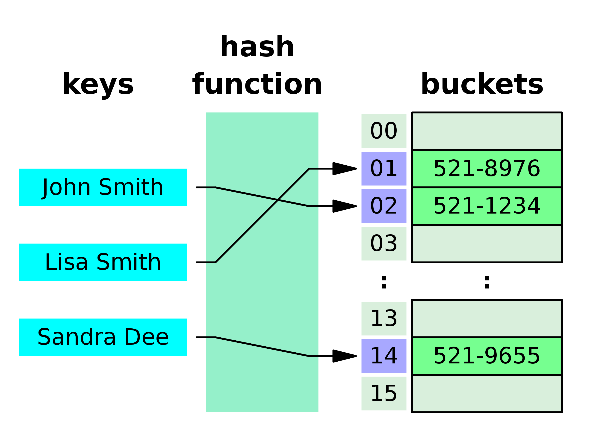

Hash
===
해시란 임의의 길이를 가진 데이터를 고정된 길이의 데이터로 매핑한 값을 말한다.

## 용어 정리

### 해싱
임의의 데이터를 해시로 바꿔주는 일 (해시 함수가 이를 담당)
### 해시 함수
임의의 데이터를 입력으로 받아 일정한 길이의 데이터로 바꿔주는 함수
### 해시테이블
키를 값에 매핑할 수 있는 자료구조로 효율적인 검색이 가능하게 해준다.

### 버킷, 슬롯
- 버킷 : 해시값을 사용하며 데이터를 저장하는 장소. 버킷의 크기는 해시테이블의 크기를 결정한다.
- 슬롯 : 버킷안에서 개별 키-값을 저장하는 위치를 결정한다. 해시값이 충돌이 나서 한 버킷에 여러 키-값 쌍을 버킷에 저장해야하는 경우 별도의 슬롯에 저장된다.

## 해시 테이블 장단점
### 장점
- 빠른 검색 속도를 보장한다.
- 효율적인 키-값 쌍 저장으로 데이터베이스, 캐시, 세션등에 유용하다.
- 중복된 키를 쉽게 제거할 수 있다.

### 단점
- 충돌 해결을 위해 데이터 수보다 많은 슬롯이 존재한다. 공간 효율성이 떨어질 수 있다.
- 충돌 가능성, 적절한 해시함수를 선택해야 한다.
- 데이터의 순서를 보장하지 못한다.

## 해시 테이블의 충돌
### 충돌
서로 다른 키들에 대해 해시 함수가 계산한 값이 같은 경우, (동일한 인덱스)하나의 버킷에 매핑되는 현상을 말한다. 적은 자원으로 많은 데이터를 효율적으로 관리할 수 있다.

### 해결
1. 체이닝(Chaining, 또는 Separate Chaining)
- 각 버킷이 연결리스트로 이루어져 있다.
- 계산된 해시값에 해당하는 버킷 위치 이미 값이 있다면, 연결리스트의 다음 노드로 값을 추가한다.
  - 주로 슬롯에는 연결리스트를 사용하고, 배열이나 자가균형이진탐색트리 등을 사용하기도 한다.
- 확장 없이 많은 충돌을 처리 가능하지만 충돌이 빈번하면 성능이 떨어진다.

2. 오픈 어드레싱(Open Addressing)
- 오픈 어드레싱 방식은 버킷 당 하나의 슬롯이 존재하며, 한 슬롯에는 하나의 데이터가 존재한다. 충돌 발생 시 다른 슬롯을 찾기 위해 재해싱이 일어난다.
- 종류
  - 선형 탐사(Linear Probing) : 해시 함수가 반환한 위치가 차있으면 다음 위치로 이동한다. 빈 슬롯 찾을때 까지 반복한다.
  - 이차 탐사(Quadratic Probing) : 선형 탐사의 변형, 충돌 시 이차함수(제곱 함수)를 사용해서 위치를 정한다. 충돌이 발생마다 제곱수를 증가시켜서 다음 위치를 찾는다. (1^2, 2^2, 3^2)
  - 이중(더블) 해싱(Double Hashing) : 해시 함수를 두 번 사용. 첫 해시 함수가 충돌나면 두 번째 해시 함수로 이동할 스텝을 결정하고, 그 만큼 값을 더하거나 빼기를 반복해서 다음 슬롯을 결정한다.

## 해시 테이블 시간복잡도
- 평균적으로 검색, 삭제, 삽입 모두 O(1)의 시간복잡도를 가진다.
- 최악의 경우 O(n)이 될 수 있다.
  - 슬롯을 연결리스트 형태로 사용할때, 모든 키가 충돌한다고 가정하면, 한 버킷에 모든 값이 몰려서 해시테이블이 연결리스트 형태가 되기 때문이다.

## 의문
일정 길이의 해시값을 반환하면, 무수히 많은 버킷이 필요한게 아닌가?
- 해시 테이블의 핵심 아이디어는 해시 함수를 사용하여 키를 **고정된 범위**의 해시 코드로 변환하고, 이 코드를 사용하여 키-값 쌍을 저장할 버킷을 결정하는 것
- 예를 들어, 두 개의 키가 있고, 하나는 해시 값이 1이고 다른 하나는 해시 값이 1000이라고 해도, 해시 테이블의 크기는 1000개의 버킷을 필요로 하지 않는다.
  - 만약 해시 테이블의 크기가 100개의 버킷으로 설정되어 있다면, 해시 함수는 모든 키에 대해 0부터 99 사이의 해시 코드를 반환한다.
  - 모듈로 연산, 곱셈 방법, SHA와 같은 복잡한 해시 알고리즘 등으로 이를 분배하곤 한다.
- 결국 효율적인 충돌 해결과 리사이징 전략을 사용이 필요하다. 해시 테이블의 초기 크기 설정과 리사이징 임계값 설정도 성능에 중요하다.
