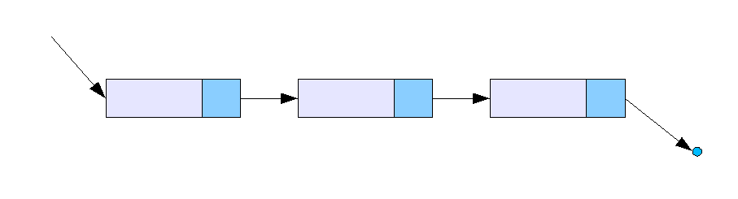

LinkedList
===

- 연속적인 메모리를 사용하지 않는 선형 데이터 구조
- 각 노드는 데이터필드와 다음 노드에 대한 참조를 포함하는 노드로 구성

## 장단점
### 장점
- 고정된 크기를 가진 배열과 다르게 크기를 동적으로 변경할 수 있다. 
- 연결 리스트는 노드의 참조만 변경하면 중간에 노드를 쉽게 추가하거나 제거할 수 있다.
### 단점
- 삽입/삭제가 빠르지만, 접근은 느리다. 순차적 접근을 하기때문에 느릴 수 있다.
- 데이터 외에 다음 노드에 대한 참조(포인터)를 저장하기때문에 추가적인 메모리를 사용하게 된다.

## 시간 복잡도
### 접근 O(n)
- 선형 구조이기 때문에 처음 노드부터 다음 노드를 하나씩 탐색하면서 데이터를 찾아야 한다.

### 탐색 O(n)
- 마찬가지로 가장 처음 노드부터 하나씩 탐색

### 삽입/삭제 O(1)
- 삽입 : 삽입하려는 위치의 앞 노드와 삽입하려는 노드의 참조만 변경하면 된다.
- 삭제 : 삭제하려는 노드의 앞 노드의 참조를 변경하고, 삭제하려는 노드의 연결을 끊으면 된다.

## 다른 연결리스트
상황에 따라 유용할 수 있다.
- 원형 연결 리스트 : 마지막 노드가 첫 노드 가르킨다.
- 이중 연결 리스트 : 탐색 시간을 줄일 수 있다.

