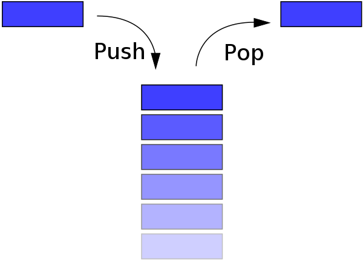
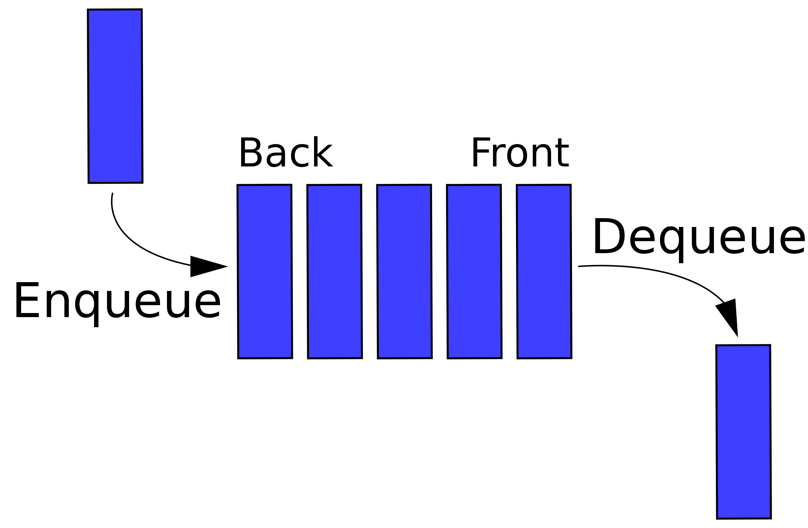

Stack
===

*출처 : 위키백과*

- 한 쪽 끝에서만 자료를 넣거나 뺄 수 있는 선형 구조를 가진다.
- LIFO (Last In First Out) : 가장 나중에 들어온 것이 가장 먼저 나온다. 후입 선출.

## 활용
- 함수 호출과 실행 콘텍스트
- 백트래킹 알고리즘, DFS
- 문자열 역순 출력
- 괄호 검사
- 후위 표시법 계산
- 웹 브라우저 뒤로가기, 실행 취소, 문자열 취소

## 자바에서의 Stack
### 주요 메서드
- push() : 값 넣기 
- pop() : 값 빼기
- peek() : 최신(최상위) 값 확인
- isEmpty() : (Vector의 메서드) 비었는지 확인. 
- empty() : (Stack의 메서드) 비었는지 확인

### 구현 방식
- 자바에서의 Stack은 Vector를 확장했고, Vector는 AbstractList를 확장, 
AbstractList는 List 인터페이스를 구현한다. 즉, 동적 배열을 기반으로 구현되어 있다.
- Stack 대신 Deque를 구현한 LinkedList나 ArrayDeque를 대신 사용할 수 있다.

### StackUnderflow vs EmptyStackException
- StackUnderflow : 스택이 비어있는 상태에서 더 이상 요소를 제거할 수 없을때 발생. 자바에서는 StackUnderFlow라는 예외가 존재하지 않는다.
- EmptyStackException : 데이터를 꺼내려고 하는데 비어있을때 발생한다.  
- StackOverflow : 용량이 가득찼는데 데이터 추가하려 할 때 발생

Queue
===

*출처 : 위키백과*

- FIFO (First IN First Out) : 먼저 집어 넣은 데이터가 먼저 나온다.
- 표를 사러 일렬로 줄 선 것과 유사

## 활용
- DFS
- 작업 스케줄링
- 캐시 구현 (LRU 사용하는 경우)
- 데이터 스트림 처리
- 프린터 대기
- 웹 서버의 요청 처리
- 키보드 버퍼링

## 자바에서의 Queue
자바에서 Queue는 인터페이스이다.
- LinkedList, ArrayDeque, PriorityQueue, ConcurrentLinkedQueue 등의 구현체를 가진다.
- Blocking이 붙은 구현체는 주로 멀티스레드 환경에서 사용한다.

### 주요 메서드
- offer() : 값 넣기
- poll() : 값 빼기
- peek() : 가장 먼저 넣은 값 확인
- isEmpty() : (Collection) 비었는지 확인