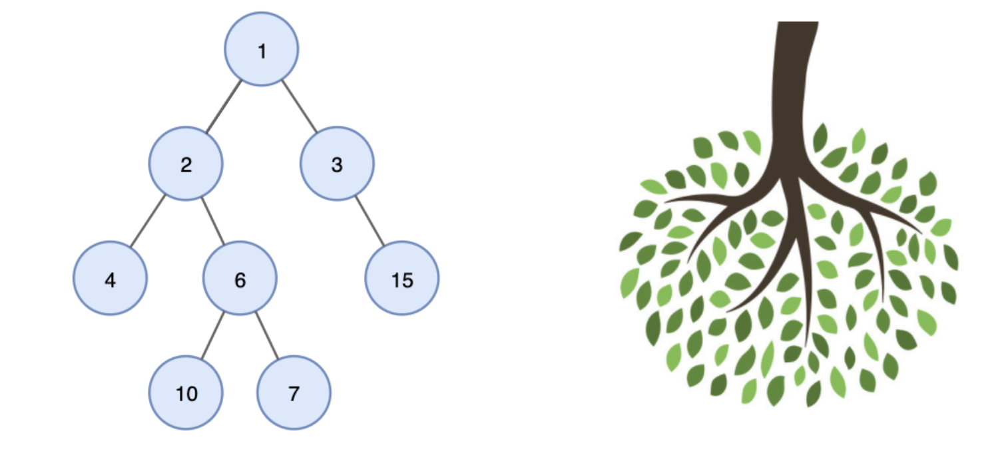
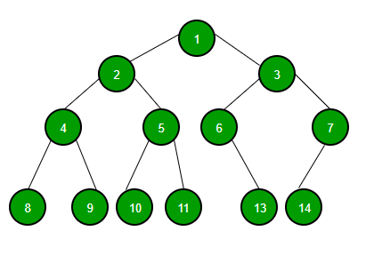
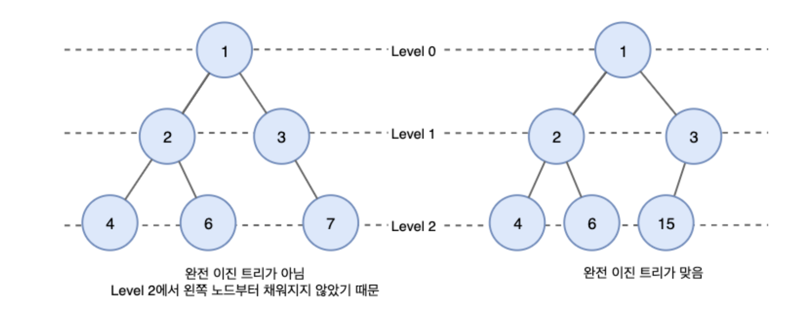
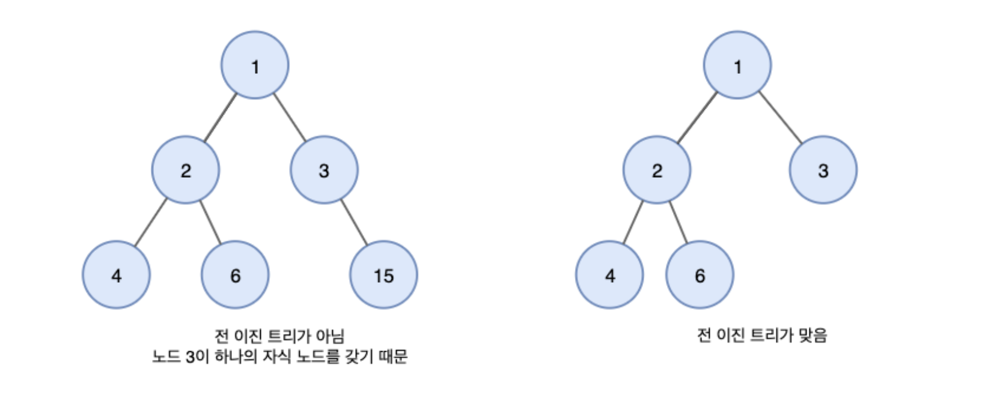

# Tree

트리는 그래프의 한 종류이다.

### 그래프는 뭐였지?

- 연결되어 있는 원소 간의 관계를 표현한 자료구조
- 연결할 객체를 나타내는 정점(Vertex)(혹은 노드)과 객체를 연결하는 간선(Edge)의 집합
- 비선형 자료구조 중 하나이다.

### 트리란?

- 한 노드에서 시작해서 다른 정점들을 순회하여 자기 자신에게 돌아오는 순환이 없는 연결 그래프. 요약하면,
  - 사이클을 가질 수 없다.
  - 한 개의 루트노드가 존재한다.
- 나무의 모양과 흡사하다. [사진 출처](https://yoongrammer.tistory.com/68)

### 특징

- 부모-자식 관계를 가진다.
- 모든 노드가 최소한 하나의 간선을 통해 다른 노드와 연결되어 있다. (E = V - 1)
- 루트에서 특정 노드로 가는 경로는 유일하다.

요약 : 싸이클x, 방향o, 루트노드 존재, 모든 노드 최소 간선 1개, 부모-자식 관계

## 용어

- 루트 노드 : 최상위 노드
- 리프 노드 : 자식이 없는 말단 노드

## 트리 순회 방식

_그림 1 - 출처 : [gyoogle](https://gyoogle.dev/blog/computer-science/data-structure/Tree.html)_

### 전위 순회

- Root -> 왼쪽 자식 -> 오른쪽 자식
- 1 → 2 → 4 → 8 → 9 → 5 → 10 → 11 → 3 → 6 → 13 → 7 → 14

### 중위 순회

- 왼쪽 자식 -> Root -> 오른쪽 자식
- 8 → 4 → 9 → 2 → 10 → 5 → 11 → 1 → 6 → 13 → 3 → 14 → 7

### 후위 순회

- 왼쪽 자식 -> 오른쪽 자식 -> Root
- 8 → 9 → 4 → 10 → 11 → 5 → 2 → 13 → 6 → 14 → 7 → 3 → 1

### 레벨 순회

- Root부터 계층별로 방문
- 1 - 2 -3 - 4- 5 - 6 - 7 ... 14

## 트리 종류

### 이진트리(Binary Tree)

- 모든 노드가 최대 두 개의 자식을 가질 수 있다.

### 이진 탐색 트리(Binary Search Tree, BST)

**특징**

- **이진 트리의 각 노드는 왼쪽 서브트리에 있는 모든 노드보다 크고, 오른쪽 서브트리에 있는 모든 노드보다 작다.**
- 데이터 검색, 삽입, 삭제연산이 빠르다.
- 불균형을 고려해서 AVL 트리나 레드-블랙 트리와 같은 균형 이진 탐색 트리를 사용하기도 한다.
- 중위 순회(in-order traversal)을 수행하면 노드의 값을 정렬된 순서로 얻을 수 있다.

**검색, 삽입, 삭제의 시간복잡도**

- 균형 상태
  - 트리의 높이가 log(n) -> O(logN)
- 편향 상태(최악의 경우 한쪽으로 트리가 완전히 치우침)
  - 트리의 높이가 N -> O(N)

**삭제 연산**

1. 리프 노드 -> 그냥 삭제
2. 자식이 1개인 노드 -> 삭제할 노드 자식 노드로 대체
3. 자식이 2개인 노드 -> 삭제할 노드의 오른쪽 자식 노드에서 가장 작은 값 or 왼쪽 자식 노드에서 가장 큰 값으로 대체

### 완전 이진트리(Complete Binary Tree)

- **모든 레벨이 완전히 채워져있고,** 마지막 레벨이 **왼쪽부터 차례로** 채워져있다.
- 그림 1의 트리는 완전 이진트리가 아니다.

### 정(전) 이진트리(Full Binary Tree)

- 모든 노드가 **0개 또는 2개**의 자식 노드를 갖는다.

### 포화 이진트리(Perfect Binary Tree)

- **모든 레벨**이 노드가 꽉 차 있다.
- 트리의 노드 개수가 정확히 2^k-1 이어야 한다.
- 모든 리프노드가 동일한 깊이(레벨)을 갖는다.
- 단일 노드는 포화 이진트리로 취급한다.

### 균형 이진트리(Balanced Binary Tree)

- 모든 **각 노드**의 왼쪽 서브트리와 오른쪽 서브트리의 높이 차이가 1이하인 트리
- 자가균형 이진트리는 자체로 계속해서 균형잡힌 형태를 유지한다는 의미도 담고 있다.
- AVL트리, 레드-블랙 트리

**AVL 트리 (Adelson-Velskii and Landis' tree)**

- 자가균형 이진트리의 한 종류로 그 중 가장 일찍 개발됨
- 균형잡힌 상태를 유지하며, 이진 검색 트리의 연산에 대한 시간 복잡도를 보장
- 균형 이진트리는 일반적인 트리 구조를 말하고, AVL 트리는 이 균형 조건을 유지하기 위한 연산이 추가된 이진트리의 한 형태이다.

### N-ary Tree 또는 M-way Tree

- 각 노드가 최대 N(M)개의 자식을 가질 수 있는 트리.
- Binary Tree를 생각해보면 된다.
- M-way 탐색 트리에 적용되는 경우를 지칭할때 M-way를 쓰는 듯

# 그 외 트리 형태들

B 트리(B-Tree), B+Tree, 트라이(Trie), 힙(Heap) 등...

# (Binary)Heap

- 우선순위를 가지는 노드가 항상 루트노드에 오게 하는 특징이 있다.
  - 부모-자식 간의 우선순위가 존재한다.
  - 우선순위큐를 구현할 수 있다.
- **완전이진트리**를 기본으로 한다.
- 최소값, 최댓값을 빠르게 찾아낼 수 있다.
- 최대 힙, 최소 힙으로 나뉜다.
  - **최대 힙** : 부모노드가 자식 노드보다 크거나 같다. 루트노드가 가장 크다.
  - **최소 힙** : 부모노드가 자식 노드보다 작거나 같다. 루트노드가 가장 작다.

## 동작 및 구현

### 최대 힙 동작

**삽입**

- 가장 마지막 노드에 삽입하고, 계속해서 부모노드와 비교를 하며 부모 노드가 더 작다면 Swap한다.

**삭제**

- 루트 노드를 제거하고, 가장 마지막 노드를 루트 노드 위치로 옮긴다.
- 그 후, 자식 중 더 큰 노드가 있다면 교환한다.

### 최소 힙 동작

최소 힙의 경우 원리는 같으나,

- 삽입시에는 부모 노드가 더 크다면 Swap한다.
- 삭제 시에는 더 작은 자식 노드와 Swap한다.

> 최대 힙의 삽입 및 삭제 과정 - [조훈데이님 블로그](https://johoonday.tistory.com/129)

### 구현

- 왼쪽 자식 index = (부모 index) \* 2
- 오른쪽 자식 index = (부모 index) \* 2 + 1
- 부모 index = (자식 index) / 2

힙을 구현할때 보통 배열을 사용한다.

예시로,

- 루트의 인덱스가 1이라고 하면, 루트의 오른쪽,왼쪽 자식은 인덱스 2,3에 저장된다.
- 또 그 두 노드의 자식은 인덱스 2의 자식 -> (4,5), 인덱스 3의 자식 -> (6,7)에 저장된다.

> 삽입, 삭제 구현 - [gyoogle heap](https://gyoogle.dev/blog/computer-science/data-structure/Heap.html)

## 활용

- 힙정렬, 다익스트라 알고리즘

## 의문

  

    배열을 이용해 힙을 구현할때, 
    연산을 통해 부모로 혹으로 자식으로 모두 이동 가능하니까,
    방향성이 존재하는거 아니야?
  

  

  (gpt 답변)

반대로, 자식 노드에서 부모 노드로 '올라가는' 것도 가능합니다.
자식 노드의 인덱스가 j라고 할 때, 부모 노드의 인덱스는 j/2 (정수 나눗셈)가 됩니다.

그러나 이런 연산들은 배열의 특성을 활용한 것이며,
'트리'나 '힙'이라는 자료 구조의 본질적인 특성은 아닙니다.
트리나 힙 자체는 노드들 사이의 '부모-자식 관계'와 '순서 속성'을 유지하는 것에 주안점을 둡니다.
이런 관점에서 보면, 힙의 '방향성'이라는 개념은 '부모 노드에서 자식 노드로의 관계'를 나타내는 것입니다.

결론적으로, '방향성'이란 말은 그래프 이론의 용어로,
힙을 이해하는 데에는 '부모-자식 관계'라는 용어가 더 적합할 수 있습니다.

  

- 정리
  - 올라가고 내려갈 수 있는 것은 배열의 특성을 이용한 것일 뿐 힙의 본질적인 특성은 아니다.
  - 트리나 힙 자체는 노드들 사이의 '부모-자식 관계'와 '순서 속성'을 유지하는 것에 주안한다.
  - 방향성은 그래프 이론 용어로 '부모-자식 관계'라는 용어가 더 적합하다.

# Red-Black Tree

# B-Tree

- 이진트리를 확장해서 더 많은 수의 자식을 받을 수 있다.
- 데이터베이스, 파일시스템에서 널리 사용
- 레벨로만 따지면 완전한 균형을 이룬 트리이다?

# B+Tree
