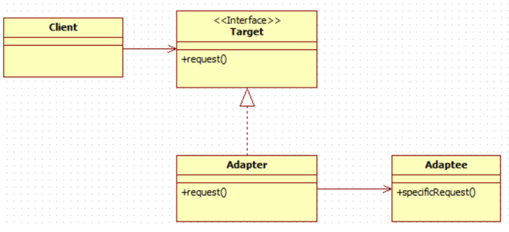
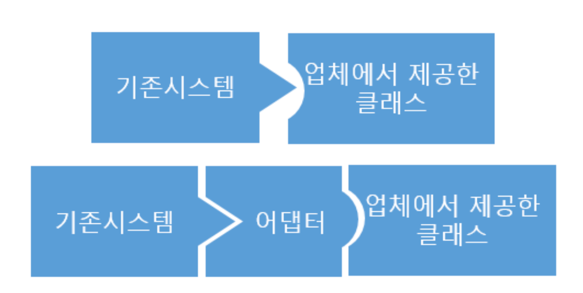
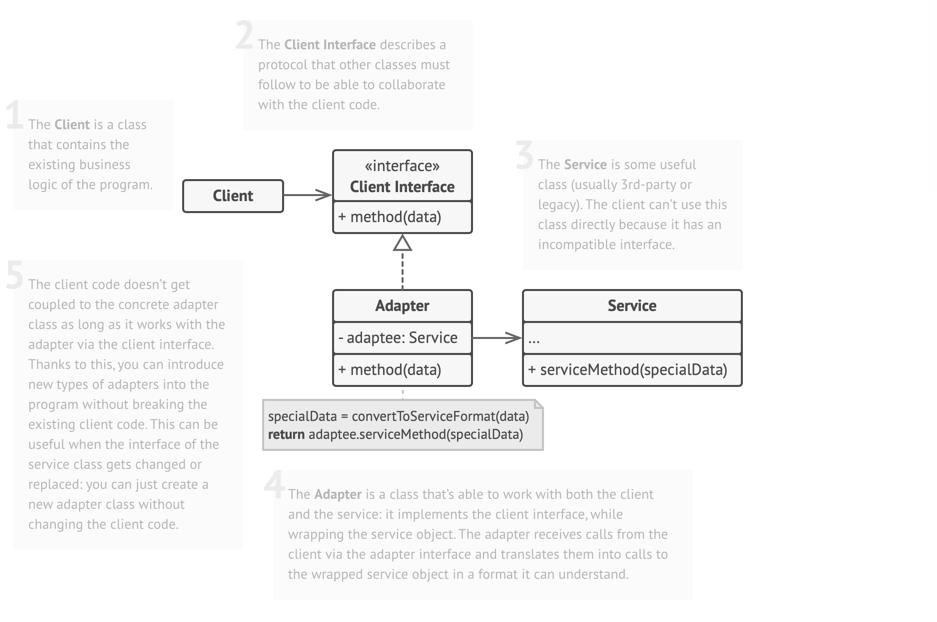
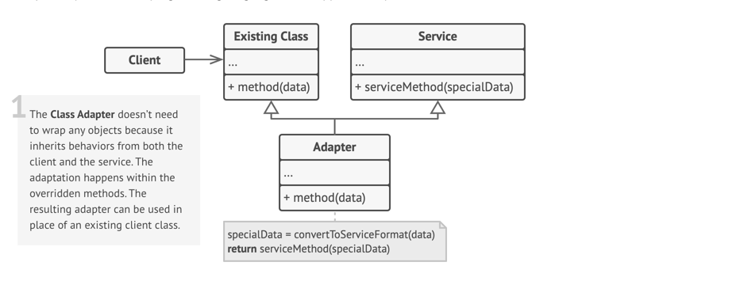

Adapter Pattern
===

- 클래스의 인터페이스를 사용자가 기대하는 다른 인터페이스로 변환하는 패턴
- 중간에서 클래스를 변환해주어서 호환되지 않는 인터페이스들이 협업할 수 있도록 돕는다.
- 실생활에 쓰는 어댑터를 떠올리면 된다.
###

- 이미 구축되어 있는 것과 새로운 것을 사용할 때 양쪽 간의 호환성을 유지해 줄수 있다.
- 기존 시스템을 수정하지 않고, 어댑터로 유연하게 해결할 수 있다.

## 객체 어댑터 (Object Adapter)

- 클라이언트가 사용하는 인터페이스가 정해져 있고, 적용할 코드가 해당 인터페이스를 따르지 않을때,
해당 인터페이스를 구현하고 컴포지션을 활용해서 해결한다.
- 어댑터는 한 객체의 인터페이스를 구현하고, 나머지 하나를 감싼다.

### gpt 예시코드
```java
// Adaptee
public class Voltage220V {
    public int output220V() {
        int src = 220;
        System.out.println("원래의 전압 : " + src + "v");
        return src;
    }
}

// Target Interface
public interface Voltage5V {
    int output5V();
}

// Adapter
public class VoltageAdapter implements Voltage5V {
    private Voltage220V voltage220V;

    public VoltageAdapter(Voltage220V voltage220V) {
        this.voltage220V = voltage220V;
    }

    public int output5V() {
        int srcV = voltage220V.output220V();
        int dstV = srcV / 44 ; // 220V를 5V로 변환하는 간단한 방법
        System.out.println("변환된 전압 : " + dstV + "v");
        return dstV;
    }
}

// Client
public class Client {
    public static void main(String[] args) {
        VoltageAdapter adapter = new VoltageAdapter(new Voltage220V());
        System.out.println("변환된 전압 : " + adapter.output5V() + "v");
    }
}
```

## 클래스 어댑터 (Class Adapter)

- 클래스 상속을 이용한 구현 방법
- 클라이언트와 서비스의 행위를 모두 상속해서 받기 때문에 어떤 객체도 감쌀 필요가 없다.
- 다중 상속을 지원하는 언어에서만 사용 가능하다.

### gpt 예시코드
```java
// Adaptee
public class Voltage220V {
    public int output220V() {
        int src = 220;
        System.out.println("원래의 전압 : " + src + "v");
        return src;
    }
}

// Target Interface
public interface Voltage5V {
    int output5V();
}

// Adapter
public class VoltageAdapter extends Voltage220V implements Voltage5V {
    public int output5V() {
        int srcV = output220V();
        int dstV = srcV / 44 ; // 220V를 5V로 변환하는 간단한 방법
        System.out.println("변환된 전압 : " + dstV + "v");
        return dstV;
    }
}

// Client
public class Client {
    public static void main(String[] args) {
        VoltageAdapter adapter = new VoltageAdapter();
        System.out.println("변환된 전압 : " + adapter.output5V() + "v");
    }
}

```

## 참고 및 출처
- https://gyoogle.dev/blog/design-pattern/Adapter%20Pattern.html -> 객체 어댑터 예시
- https://ko.wikipedia.org/wiki/%EC%96%B4%EB%8C%91%ED%84%B0_%ED%8C%A8%ED%84%B4
- https://inpa.tistory.com/entry/GOF-%F0%9F%92%A0-%EC%96%B4%EB%8C%91%ED%84%B0Adaptor-%ED%8C%A8%ED%84%B4-%EC%A0%9C%EB%8C%80%EB%A1%9C-%EB%B0%B0%EC%9B%8C%EB%B3%B4%EC%9E%90 -> 두 개 예시모두 있음
- https://refactoring.guru/design-patterns/adapter
