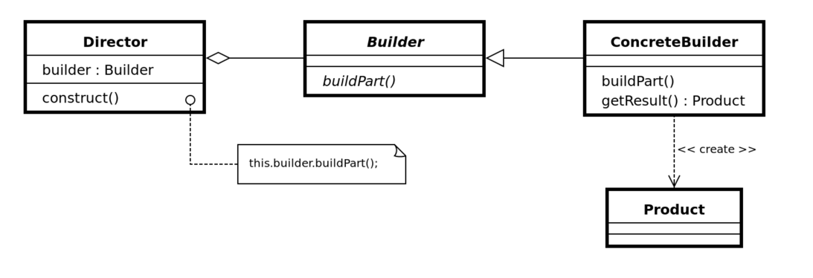

Builder Pattern
===

- 복잡한 객체의 생성 과정과 표현 방법을 분리하여 다양한 구성의 인스턴스를 만드는 생성 패턴
    - 동일한 생성 절차에서 서로 다른 표현 결과를 만들 수 있게 한다.
- Builder 클래스를 메서드 체이닝 형태로 호출해서 자연스럽게 인스턴스를 구성하고, build()로 최종 생성한다.
- 디렉터 클래스를 포함하는 경우도 있다. 디렉터는 특정 순서로 생성 단계들을 실행하는 책임만 있다.

### 사용 코드
```java
public class User {
  long id;
  String userName;
  String phoneNum;
  int age;

  public User(long id, String userName, String phoneNum, int age) {
    this.id = id;
    this.userName = userName;
    this.phoneNum = phoneNum;
    this.age = age;
  }
}
```

```java
public class UserBuilder {
    long id;
    String userName;
    String phoneNum;
    int age;

    public UserBuilder id(long id) {
        this.id = id;
        return this;
    }

    public UserBuilder userName(String userName) {
        this.userName = userName;
        return this;
    }

    public UserBuilder phoneNum(String phoneNum) {
        this.phoneNum = phoneNum;
        return this;
    }

    public UserBuilder age(int age) {
        this.age = age;
        return this;
    }

    public User build() {
        return new User(id, userName, phoneNum, age);
    }
}
```

```java
public class Main {
    public static void main(String[] args) {
      // builder
      User user = new UserBuilder()
              .id(id)
              .userName(userName)
              .phoneNum(phoneNum)
              .age(age)
              .build();

      System.out.println(user);
    }
}
```

### 장점
- 직관적으로 각 매개변수의 의미를 알 수 있다. 특히 생성자 매개변수가 많거나 선택적인 경우 유용하다.
- 객체 불변성을 유지해준다.
- 필요한 값만 생성할 수 있다. 생성자 오버로딩을 할 필요가 없다.
- Builder 생성자에 필수 값을 넣어서 필수 값을 구분할 수 있다.
- 객체를 생성 단계를 지연할 수 있다. ex) build()를 하지 않고 컬렉션에 넣었다가 나중에 할 수도 있다.
- 변경 가능성을 줄여준다.

### 단점
- 코드의 복잡성
- 성능에 심히 예민한 경우 오버헤드 주의

## SimpleBuilder
이펙티브 자바에서 소개한 패턴. gof 패턴과 구분하기 위해 Simple Builder Pattern으로 불리기도 한다.
### 예시 코드
```java
public class User {
    long id;
    String userName;
    String phoneNum;
    int age;
    
    public static class SimpleBuilder {
        long id;
        String userName;
        String phoneNum;
        int age;

        SimpleBuilder id(long id) {
            this.id = id;
            return this;
        }
        SimpleBuilder userName(String userName) {
            this.userName = userName;
            return this;
        }

        SimpleBuilder phoneNum(String phoneNum) {
            this.phoneNum = phoneNum;
            return this;
        }

        SimpleBuilder age(int age) {
            this.age = age;
            return this;
        }

        User build() {
            return new User(this);
        }
    }
    
    private User(SimpleBuilder builder) {
        this.id = builder.id;
        this.userName = builder.userName;
        this.phoneNum = builder.phoneNum;
        this.age = builder.age;
    }
}
```
- 내부 static 클래스를 사용한 방식
- 메모리 누수 문제를 해결하기 위해 static 내부 클래스를 활용하는게 좋다.
- 결합되어 있어서 클래스간 관계 파악이 쉽고, 하나의 빌더 클래스는 하나의 대상 객체 생성을 위해서만 사용된다.
- 생성자를 private 설정해서 오직 빌더 객체에 의해 초기화된다.
- 객체 생성 단계가 복잡한 경우나 다양한 표현이 필요한 경우에는 한계가 있을 수 있다.

## lombok의 빌더
- 자바에서는 접근제어자 미기재 시 package 레벨로 동작
- 클래스이름이 User라면 User.UserBuilder 빌더 클래스가 자동으로 생성된ㄷ.ㅏ
- final 키워드에는 적합하지 않다.
  - 초기화 했다면 제외하고 생성
  - 초기화 안했다면 컴파일 에러는 발생하지 않는다.

## 참고 및 출처
- https://refactoring.guru/ko/design-patterns/builder
- https://inpa.tistory.com/entry/GOF-%F0%9F%92%A0-%EB%B9%8C%EB%8D%94Builder-%ED%8C%A8%ED%84%B4-%EB%81%9D%ED%8C%90%EC%99%95-%EC%A0%95%EB%A6%AC
- https://ko.wikipedia.org/wiki/%EB%B9%8C%EB%8D%94_%ED%8C%A8%ED%84%B4
- https://velog.io/@park2348190/Lombok-Builder%EC%9D%98-%EB%8F%99%EC%9E%91-%EC%9B%90%EB%A6%AC