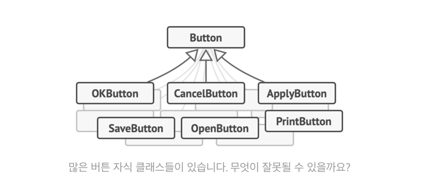
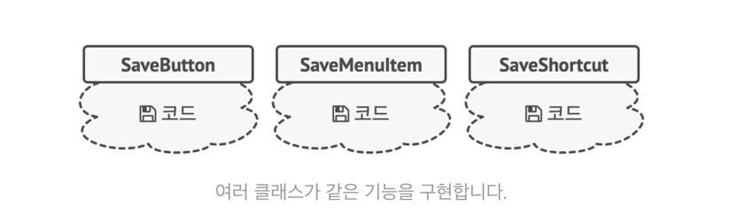
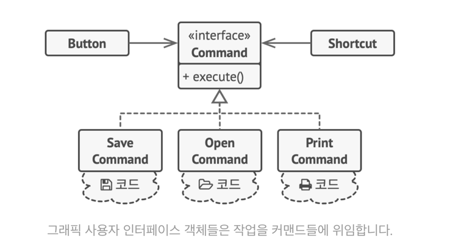
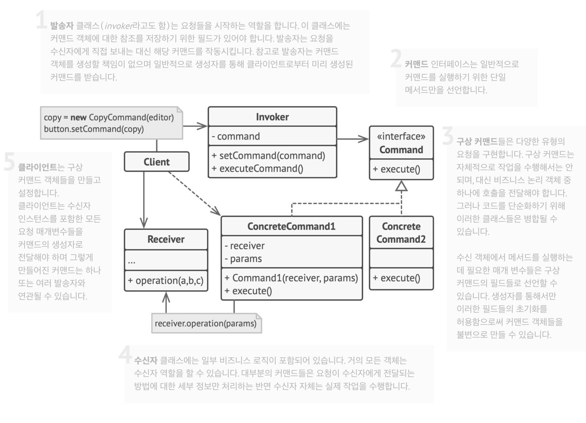

Command Pattern
===
- 커맨드 패턴(Command pattern)이란 요청을 객체의 형태로 캡슐화하여 
사용자가 보낸 요청을 나중에 이용할 수 있도록 한다.
- 매서드 이름, 매개변수 등 요청에 필요한 정보를 저장 또는 로깅, 취소하는 작업을 지원할 수 있다.
- 커맨드 패턴에는 명령(command), 수신자(receiver), 발동자(invoker), 클라이언트(client)의 네개의 용어가 항상 따른다.

## Command Pattern 필요한 예시
텍스트 편집기 앱을 개발한다고 가정하자. (출처 guru 사이트)


- 도구 모음 버튼, 다양한 대화상자들의 버튼들에 사용할 수 있는 Button 클래스를 만들었다.
- 다양한 버튼들을 처리하는 객체를 만든다.
- 많은 자식 클래스들이 있는데, Button을 수정하면 자식의 코드가 영향을 받는다.


- 복사/붙여넣기 기능이 단축키, 바로가기, 메뉴 등 다양하게 있는 경우
    - 여러 클래스가 같은 기능을 구현하게 된다.


- 인터페이스 활용한다.
- UI 계층과 비즈니스 로직 계층 간의 결합도를 줄이는 중간 계층이 된다.
## 구조


## 적용
- 특정 메서드 호출을 독립실행형 객체로 전환할 수 있다.
  - 커맨드들을 메서드 인수로 전달
  - 다른 객체 내부에 저장하고, 런타임에 연결된 커맨드를 전환하는 등 가능
- 작업들의 실행을 예약하거나, 작업들을 대기열에 넣거나 작업들을 원격으로 실행하는 경우
- 되돌릴 수 있는 작업을 구현하려고 할 때 사용
  - 실행 취소/다시 실행에 많이 사용되는 패턴이다.
  - 단점도 있다. 메멘토나 대안적 구현을 해야 한다.

## gpt 예시 코드
```java
// Command Interface
public interface Command {
    void execute();
}

// Concrete Command
public class LightOnCommand implements Command {
    // Receiver
    private Light light;

    public LightOnCommand(Light light) {
        this.light = light;
    }

    public void execute() {
        light.turnOn();
    }
}

// Receiver
public class Light {
    public void turnOn() {
        System.out.println("The light is on");
    }

    public void turnOff() {
        System.out.println("The light is off");
    }
}

// Invoker
public class RemoteControl {
    private Command command;

    public void setCommand(Command command) {
        this.command = command;
    }

    public void pressButton() {
        command.execute();
    }
}

// Client
public class Client {
    public static void main(String[] args) {
        // Receiver
        Light light = new Light();

        // Command
        Command lightOn = new LightOnCommand(light);

        // Invoker
        RemoteControl control = new RemoteControl();

        // Set command and execute
        control.setCommand(lightOn);
        control.pressButton();  // The light is on
    }
}
```
Receiver
- Receiver는 요청을 수행하기 위해 필요한 모든 정보를 알고 있는 객체. 즉, 실제로 작업이 수행되는 곳
- Command 객체에 의해 encapsulation되며, Command는 Receiver에 정의된 메소드를 호출하여 특정 작업을 수행

Invoker
- 요청들을 시작하는 역할
- 
## 참고 및 출처
- [guru 커맨드 패턴](https://refactoring.guru/ko/design-patterns/command)
- [guru 자바 코드 예시 : undo, JButton](https://refactoring.guru/ko/design-patterns/command/java/example)
  - editor가 Reciever와 Invoker 모두 수행하는 예시
- https://victorydntmd.tistory.com/295
- https://velog.io/@newtownboy/%EB%94%94%EC%9E%90%EC%9D%B8%ED%8C%A8%ED%84%B4-%EC%BB%A4%EB%A7%A8%EB%93%9C%ED%8C%A8%ED%84%B4Command-Pattern
- https://leveloper.tistory.com/156
- https://ko.wikipedia.org/wiki/%EC%BB%A4%EB%A7%A8%EB%93%9C_%ED%8C%A8%ED%84%B4
