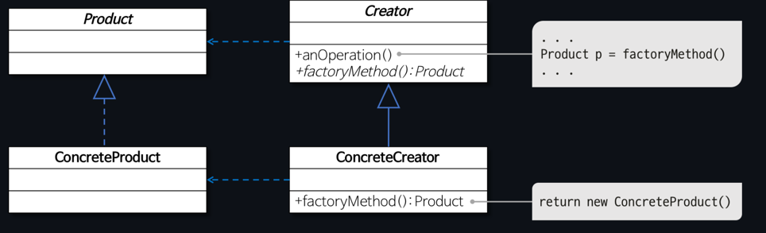

Factory Method Pattern
===
- 객체를 생성하는 부분을 서브 클래스로 분리해 처리하도록 캡슐화하는 패턴. 서브클래스에 생성을 위임하는게 핵심이다.
- 객체의 생성 코드를 별도의 클래스/메서드로 분리 -> 객체 생성의 변화에 대비하는데 유용하다.
- 스트래티지 패턴, 싱글턴 패턴, 템플릿 메서드 패턴을 사용한다.

### 장점
- 객체 생성의 유연성 증가
  - 팩토리 메서드 패턴은 클래스에게 객체 생성의 책임을 위임하여 더 유연한 코드를 작성할 수 있다.
- 코드 재사용과 유지 보수성 향상
  - 객체 생성 코드가 한 곳에 집중되므로 코드의 중복을 줄이고 유지 보수성을 높여준다.
- 의존성 역전 
  - 상위 모듈이 하위 모듈에 종속되지 않도록 하는 객체 지향 원칙을 준수


- 역할이 수행하는 작업
  - Product
    - 팩토리 메서드로 생성될 객체의 공통 인터페이스
  - ConcreteProduct
    - 구체적으로 객체가 생성되는 클래스
  - Creator
    - 팩토리 메서드를 갖는 클래스
  - ConcreteCreator
    - 팩토리 메서드를 구현하는 클래스로 ConcreteProduct 객체를 생성

## 추상 팩토리 패턴
- 추상 팩토리 패턴의 핵심은 클라이언트가 직접 객체를 생성하지 않고, 이를 팩토리 객체에 위임함으로써 무엇을 생성할지, 어떻게 생성할지에 대한 구체적인 책임을 분리하는 것
- 그룹을 생성하는데 중점을 둔다.
- 추상 팩토리 패턴에서 클라이언트는 단지 추상 인터페이스를 통해 객체들을 생성하고 사용할 뿐, 실제로 어떤 클래스의 인스턴스가 생성되는지는 알지 못한다.
- 클라이언트는 구체적인 팩토리를 선택하는 데에만 관여하고, 그 이후의 객체 생성은 선택된 팩토리가 처리

### 팩토리 메서드 패턴 예시 코드
```java
public interface Animal {
    void makeSound();
}

public class Dog implements Animal {
    @Override
    public void makeSound() {
        System.out.println("Bark! Bark!");
    }
}

public class Cat implements Animal {
    @Override
    public void makeSound() {
        System.out.println("Meow! Meow!");
    }
}

public abstract class AnimalFactory {
    public abstract Animal createAnimal();
}

public class DogFactory extends AnimalFactory {
    @Override
    public Animal createAnimal() {
        return new Dog();
    }
}

public class CatFactory extends AnimalFactory {
    @Override
    public Animal createAnimal() {
        return new Cat();
    }
}

public class Main {
    public static void main(String[] args) {
        AnimalFactory dogFactory = new DogFactory();
        Animal dog = dogFactory.createAnimal();
        dog.makeSound();

        AnimalFactory catFactory = new CatFactory();
        Animal cat = catFactory.createAnimal();
        cat.makeSound();
    }
}

```

### 추상 팩토리 패턴 예시 코드
```java
public interface Animal {
    void makeSound();
}

public class Dog implements Animal {
    @Override
    public void makeSound() {
        System.out.println("Bark! Bark!");
    }
}

public class Cat implements Animal {
    @Override
    public void makeSound() {
        System.out.println("Meow! Meow!");
    }
}

public interface AnimalFactory {
    Animal createAnimal();
}

public class DogFactory implements AnimalFactory {
    @Override
    public Animal createAnimal() {
        return new Dog();
    }
}

public class CatFactory implements AnimalFactory {
    @Override
    public Animal createAnimal() {
        return new Cat();
    }
}

public class FactoryProducer {
    public static AnimalFactory getFactory(String choice) {
        if (choice.equalsIgnoreCase("Dog")) {
            return new DogFactory();
        } else if (choice.equalsIgnoreCase("Cat")) {
            return new CatFactory();
        }
        return null;
    }
}

public class Main {
    public static void main(String[] args) {
        AnimalFactory animalFactory = FactoryProducer.getFactory("Dog");
        Animal dog = animalFactory.createAnimal();
        dog.makeSound();

        animalFactory = FactoryProducer.getFactory("Cat");
        Animal cat = animalFactory.createAnimal();
        cat.makeSound();
    }
}
```
- 추상 팩토리의 다른 예시가 더 적절할듯.
- 그룹화 시키고, 한 팩토리에서 여러 개를 생성하는 것에 대한 예시 필요
- 

## 참고 및 출처
- [추상 팩토리 뱀귤님 블로그](https://bcp0109.tistory.com/368), [팩토리 메서드 패턴 뱀귤님 블로그](https://bcp0109.tistory.com/367)
- https://github.com/WeareSoft/tech-interview/blob/master/contents/designpattern.md#factory-method-%ED%8C%A8%ED%84%B4