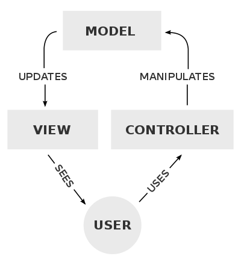
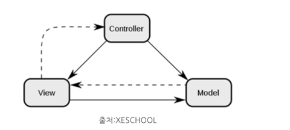

MVC
===

- Model-View-Controller의 약자로 디자인 패턴의 하나이다.
- 사용자 인터페이스로부터 비즈니스 로직을 분리하여 애플리케이션의 시각적 요소나 
그 이면에서 실행되는 비즈니스 로직을 서로 영향 없이 쉽게 고칠 수 있게 한다. 
즉, 관심사를 분리하여 더 나은 업무의 분리와 향상된 관리를 제공한다.
- MVVM, MVP, MVW 등은 MVC를 기반으로 둔 다른 디자인 패턴이다.

## 장점
- 분리된 관심사
  - 각각 애플리케이션이 맡은바에만 집중할 수 있다.
  - 각 컴포넌트의 독립적인 개발과 테스트를 가능하게 한다.
  - 가독성과 유지보수성 증가
- 재사용성과 확장성이 증가한다.
- 병렬적으로 각기 개발 가능

## 단점
- 복잡성으로 인해 MVC 패턴에 대한 이해가 필요하다.
- 여러 파일과 클래스로 분하라기 때문에 코드 네비게이션이 많이 필요. 코드를 추적하고 디버그하는데 어려움 초래 가능
- 컨트롤러를 통해 소통을 하기 떄문에 의존성이 완전히 분리될 수 없다.

## MVC

### Model
- 애플리케이션의 데이터 구조와 비즈니스 로직, 규칙을 나타낸다.
  - **무엇**을 할지 정의
  - 데이터의 특징과 행동을 정의한다. 검색, 삽입, 업데이트, 삭제 방법들을 정의하는 메서드와 같은 비즈니스 로직을 포함한다.
- 뷰와 컨트롤러에 대해 모른다.

### View
- 애플리케이션의 데이터를 보여주는 방식을 정의한다. 즉, UI를 담당한다.
- 사용자의 입력을 받고 컨트롤러로 보낸다.
- 어떠한 데이터도 가공하지 않는다. 주어진 데이터를 보여주고, 유저와 상호작용을 컨트롤러에게 보여줄 뿐이다.
- 모델을 알지만 컨트롤러에 대해 모른다. (모델을 안다는건 느슨한 연결을 뜻하고 모른다고 볼 수도 있을듯 하다.)

### Controller
- 모델과 뷰 사이의 다리 역할. 명령을 모델과 뷰 부분으로 라우팅한다.
- **어떻게** 할지를 정의 
  - 모든 사용자 요청을 처리한다. 사용자 입력 및 상호작용을 처리한다.
  - 사용자로부터 입력에 대한 응답으로 모델의 상태를 변경하고, 결과를 뷰에 반영한다.
- 모델과 뷰를 모두 안다.

## 참고 및 출처
- https://ko.wikipedia.org/wiki/%EB%AA%A8%EB%8D%B8-%EB%B7%B0-%EC%BB%A8%ED%8A%B8%EB%A1%A4%EB%9F%AC
- https://developer.mozilla.org/ko/docs/Glossary/MVC
