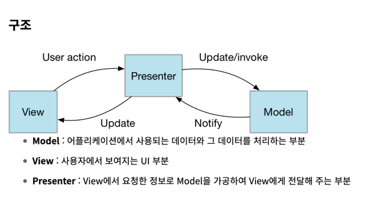
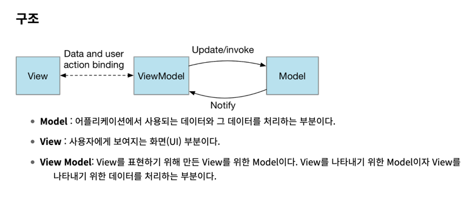

MVP (Model-View-Presenter)
===

- Presenter가 Model과 View 사이의 중개자(인터페이스) 역할을 한다.
- View와 Model 사이의 의존성이 줄어 결합도를 느슨하게 만들 수 있다. (MVC 문제 해결)
- 사용자 인터페이스에 대한 로직을 별도의 Presenter 클래스로 분리하므로, View는 오직 UI 표현에만 집중
- UI 로직을 관리하는 데 주로 사용됩니다. 특히 안드로이드 개발
## gpt 예시 코드
```java
// Model
public class User {
    private String username;
    private String password;

    // getters and setters
}

// View interface
public interface LoginView {
    String getUsername();
    String getPassword();
    void showValidationError();
    void loginSuccess();
    void loginError();
}

// Presenter
public class LoginPresenter {
    private LoginView view;
    private User user;

    public LoginPresenter(LoginView view) {
        this.view = view;
        this.user = new User();
    }

    public void login() {
        String username = view.getUsername();
        String password = view.getPassword();

        if (username.isEmpty() || password.isEmpty()) {
            view.showValidationError();
        } else {
            // Here you could do actual authentication against a backend
            // In this example we just check if username and password are the same
            if (username.equals(password)) {
                view.loginSuccess();
            } else {
                view.loginError();
            }
        }
    }
}

// View implementation
public class LoginActivity implements LoginView {
    private LoginPresenter presenter;

    public LoginActivity() {
        this.presenter = new LoginPresenter(this);
    }

    @Override
    public String getUsername() {
        // Get username from UI
        return "username";
    }

    @Override
    public String getPassword() {
        // Get password from UI
        return "password";
    }

    // Other methods
}
```

## 동작 및 설명
- View는 일반적으로 인터페이스를 통해 Presenter에게 자신의 상태를 알리고 Presenter는 이를 Model에 반영한다.
- Model의 상태가 바뀌면, 이 정보를 Presenter가 View에 전달하여 UI를 업데이트한다.
- View와 Model 사이의 의존성이 줄어 결합도를 느슨하게 만들 수 있다.
  - Presenter는 Interface를 이용해 View와 상호작용한다.
  - 인터페이스를 통해 통신하기 때문에 View와 Model 사이 직접적인 의존성이 줄어든다.
- View와 Presenter는 일반적으로 1:1 관계를 가진다.

### Presenter
- Presenter는 Controller와 비교하면, View에 대한 책임을 더 많이 가지게 된다. View에 대한 직접적인 참조를 가진다.
- 사용자 입력 처리, Model 업데이트, View 업데이트를 한다.

### 한계
- Presenter와 View가 강하게 결합되어 코드 복잡도가 증가할 수 있다.
- 모든 UI가 Presenter 로직에 들어가서 코드량이 늘어날 수 있다.
- View 변경이 Presenter에 영향을 줄 수 있다. -> View 인터페이스가 바뀐다면 영향을 준다.
- 곰튀김님 영상 : View와 Presenter는 1대1의 관계이다. Presenter가 여러개 만들어져야 한다. (gpt는 여러개 만들어도 되긴 한다고 함)

---

MVVM (Model-View-ViewModel)
===


- WPF, Silverlight, 또는 AngularJS와 같이 데이터 바인딩을 지원하는 프레임워크에서 유용
- View와 ViewModel이 자동 동기화 되고, 필요에 따라 Model에서 데이터를 가져온다.

### MVP 한계 극복
- MVVM에서 View와 ViewModel을 더 분리하려고 한다. View와 Model 사이의 의존성이 없다.
- 데이터 바인딩을 이용해 View와 ViewModel 사이의 상호작용을 자동화했기 떄문이다.
- ViewModel은 Model과 View 사이의 연결고리 역할을 하며, 
이를 통해 View의 코드를 간결하게 유지하고, 테스트와 유지보수를 더 쉽게 할 수 있다.

## 동작
1. 사용자의 Action들은 View를 통해 들어온다.
2. View에 Action이 들어오면, Command 패턴으로 View Model에 Action을 전달한다.
3. View Model은 Model에게 데이터를 요청한다.
4. Model은 View Model에게 요청받은 데이터를 응답한다.
5. View는 View Model과 Data Binding하여 화면을 나타낸다.

## 장단점
### 장점
- 데이터 바인딩을 지원하는 프레임워크에서는 MVVM이 잘 동작하며, 이로 인해 ViewModel과 View 사이의 자동 동기화가 가능해진다.
- View와 ViewModel은 상호 독립적입니다. ViewModel이 View에 대해 알 필요가 없기 때문에, 재사용성이 높아진다.
- MVVM은 View의 비즈니스 로직을 완전히 분리하므로, UI와 비즈니스 로직 간의 결합도를 줄이는 데 도움이 된다.

### 단점
- 복잡한 데이터 바인딩은 디버깅을 어렵게 만들 수 있습니다.
- ViewModel이 과도하게 복잡해질 수 있습니다. 이는 ViewModel이 View를 처리하는 로직을 다루기 때문에 발생합니다.
- 대규모 프로젝트에서는 ViewModel이 너무 많은 책임을 지게 될 수 있습니다, 이는 'God object' 문제로 이어질 수 있습니다.

## 참고 및 출처
- https://doqtqu.tistory.com/332
- https://www.developier.com/2020/03/design-pattern-04-mvc-mvp-mvvm-3.html
