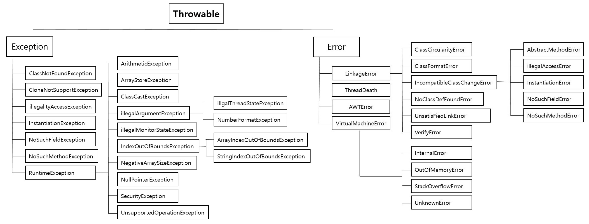

# Exception

===

## Exception vs Error

프로그램이 실행 중 어떤 원인에 의해서 오작동을 하거나 비정상적으로 종료되는 경우를 프로그램 오류라고 한다. 오류는 에러와 예외로 구분된다.

### Throwable

- 예외처리를 할 수 있는 최상위 클래스이다.
- Exception과 Error는 Throwable을 상속받는다.

### Error

- 심각한 오류. 대부분 복구할 수 없다.
- 프로세스에 심각한 문제를 야기 시켜 프로세스를 종료 시킬 수 있다.
- 컴파일 오류, JVM 또는 하드웨어 자원의 심각한 부족, 시스템 레벨의 실패 등
- ex) OutOfMemoryError, StackOverflowError, NoClassDefFoundError, VirtualMachineError 등

#### OutOfMemoryError, OOM

- JVM에 설정된 메모리의 한계를 벗어난 상황일 때 발생
- 힙 사이즈가 부족할때, 너무 많은 class를 로드할때, 가용가능한 swap이 없을때, 큰 메모리의 native메소드가 호출될 때 등
- 해결 : dump 파일분석, jvm 옵션 수정 등

#### 처리

- 개발자가 직접 처리하기 보다는 안전하게 종료하고, 로깅이나 모니터링을 하는게 일반적이다.

### Exception

- 비교적 덜 심각한 오류
- 애플리케이션 런타임에 발생할 수 있는 예외적 상황
- 체크된 예외와 체크되지 않은 예외로 나뉜다.

## 체크된 예외(Checked Exception) vs 체크되지 않은 예외(Unchecked Exception)

### Checked Exception

- RuntimeException 이외의 모든 예외. (Exception 상속o, RuntimeException 상속x)
- 컴파일러가 예외 처리를 강제하는 예외. 예외를 처리하지 않으면 컴파일이 안된다.
- JVM 외부와 통신(네트워크, 파일시스템 등)할 때 주로 쓰인다.
- ex) IOException, SQLException 등

### Unchecked Exception

- RuntimeException 하위의 모든 예외
- 컴파일 시점에 처리를 강제하지 않는 예외. 컴파일 때 체크되지 않고, Runtime에 발생하는 예외를 말한다.
- ex) NullPointerException, IndexOutOfBoundException, ClassCastException 등

### Spring 트랜잭션 rollback 대상

- 스프링 트랜잭션 추상화에서 rollback 대상은 바로 UncheckedException이다.
  - 체크되지 않은 예외가 주로 프로그램의 버그나 예상치 못한 상황에서 발생하므로, 이러한 경우에는 데이터의 일관성을 유지하기 위해 트랜잭션을 롤백한다.
  - 체크된 예외는 개발자가 예상하고 처리할 수 있는 예외로 간주되므로, 기본적으로 체크된 예외가 발생해도 트랜잭션을 커밋한다.

## 참고

- https://gyoogle.dev/blog/computer-language/Java/Error%20&%20Exception.html
- https://github.com/ksundong/backend-interview-question
