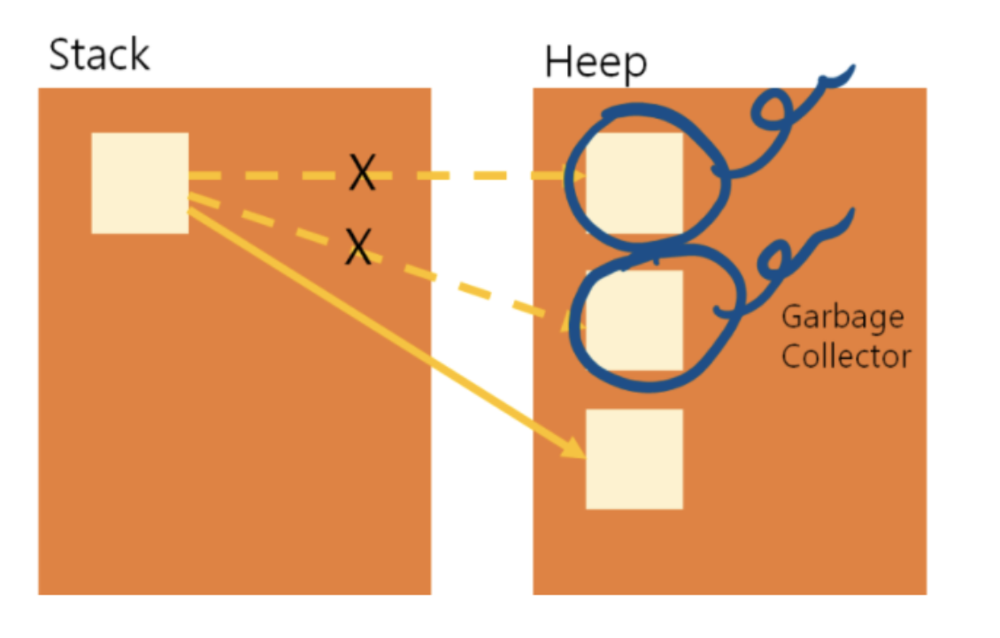
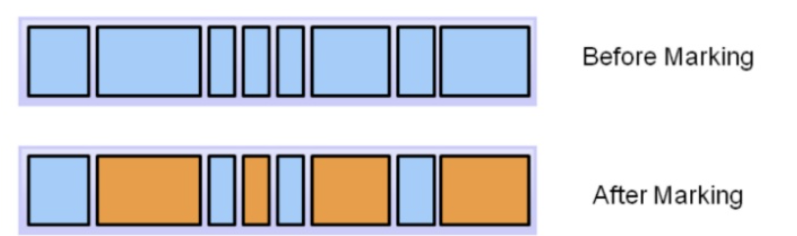
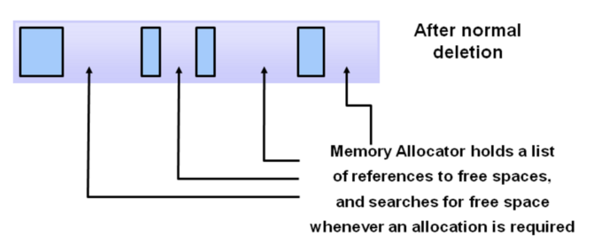
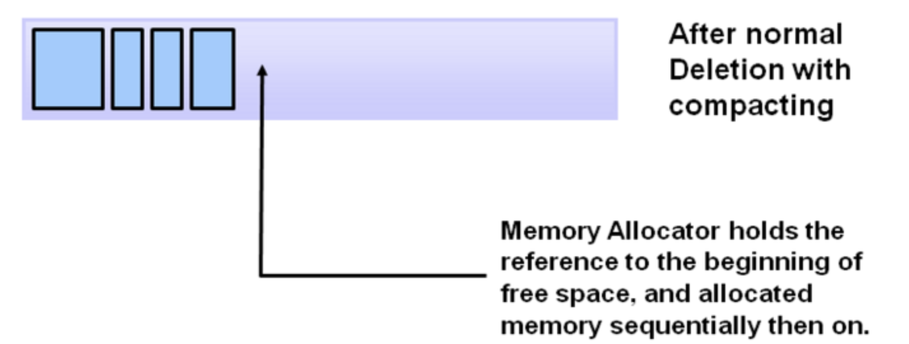
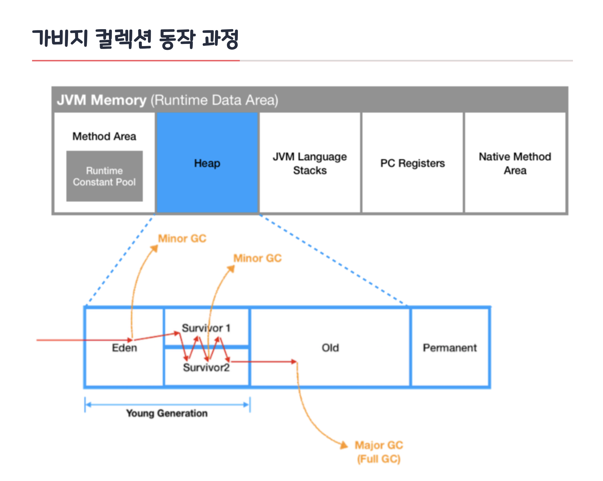

# 1. Garbage Collection(GC)

- 자바에서 Heap 영역에 동적으로 할당했던 메모리 중 사용하지 않는 메모리 객체를 모아 주기적으로 제거하는 프로세스
- C/C++에서는 사용하지 않는 객체의 메모리를 직접 해줘야 한다. 하지만 자바에서는 GC가 자동으로 사용하지 않는 객체를 수거한다.
- 파이썬, 자바스크립트, Go 등에도 기본으로 내장되어 있다.

## 1.1. 장단점

### 장점

- 개발에만 집중할 수 있게 도와준다.

### 단점

- 메모리가 언제 해제되는지 정확하게 알 수 없어 제어하기 힘들다.
- GC가 동작하는 동안 발생하는 Stop-The-World에 주의해야한다.

### Stop The World(STW)

- GC를 실행하기 위해 JVM 애플리케이션 실행을 멈추는 것
- 어떤 GC 알고리즘을 사용하던 발생하게 된다.
- 대개 GC 튜닝은 이 시간을 줄이는 것이다.
- 필요 : 메모리 일관성과 안전성, 효율적인 메모리 관리

## 1.2. GC가 소멸 대상을 선정하는 방법

### Reachability

**도달 가능성(Reachability)**이라는 개념을 이용한다.

- Reachable : 객체가 참조되고 있는 상태
- Unreachable : 객체가 참조되고 있지 않은 상태
- 객체에 레퍼런스가 있으면 Reachable, 객체에 유효한 레퍼런스가 없으면 Unreachable로 구분하여 수거한다.
- ex) Heap에 있는 B가 Heap의 A를 참조하더라도, B가 unreachable이 된다면, A도 수거 대상이 된다.

### 참조하는 상황 4가지

- 힙 내의 다른 객체에 의한 참조
- (Root set) : Java 스택, 네이티브 스택, 메서드 영역에 의한 참조
- 참조 사슬 중 최초에 참조한 것을 Root set이라 함

# 2. GC 전략 및 알고리즘

## 2.1. Mark And Sweep, Mark And Compact

Mark -> Sweep -> Compact

### 2.1.1. Mark 단계

- 가비지 컬렉터는 루트 집합(root set)에서 시작하여, 참조를 따라가며 도달할 수 있는 모든 객체를 마킹한다.
- 루트 집합은 스레드 스택, 정적 필드, JNI 참조 등에서 시작하는 객체 참조들을 포함한다.

### 2.1.2. Sweep 단계

- 힙 전체를 스캔하며, 마킹되지 않은 객체를 찾아 메모리에서 해제한다.
- 이 단계에서 메모리 단편화가 발생할 수 있으며, 이는 후속의 Compact 단계로 해결할 수 있다.

Mark and Compact

- Mark and Sweep에 Compact 단계를 추가한다.

### 2.1.3. Compact 단계

- 마킹된 객체를 힙의 한 쪽으로 모은다. (압축)
- 이 과정은 메모리 단편화를 제거하고, 연속적인 메모리 할당을 용이하게 만든다. (가비지 컬렉터 종류에 따라 하지 않는 경우도 있음)

## 2.3. Generational GC

### 2.3.1. 배경

#### Weak Generational Hypothesis

- 신규로 생성한 객체의 대부분은 금방 사용하지 않는 상태가 되고, 오래된 객체에서 신규 객체로의 참조는 매우 적게 존재한다는 가설
- 가설에 기반해 Young 영역 Old 영역으로 메모리를 분할
  - 신규로 생성되는 객체는 Young 영역에 보관
  - 오랫동안 살아남은 객체는 Old 영역에 보관

### 2.3.2. 영역 구분

#### Young 영역

- 새롭게 생성한 객체의 대부분
- 금방 접근 불가능 상태가 되기 때문에 매우 많은 객체가 Young 영역에 생성되었다가 사라진다.
- 이 영역에서 객체가 사라질때 Minor GC가 발생

#### Old 영역

- Unreachable이 되지 않고 Young 영역에서 살아남은 객체가 여기로 복사된다.
- 대부분 Young 영역보다 크게 할당하며, 크기가 큰 만큼 Young 영역보다 GC는 적게 발생
- 이 영역에서 객체가 사라질 때 Major GC(혹은 Full GC) 가 발생한다.

* Old 영역이 Young 영역보다 크게 할당되는 이유는 Young 영역의 수명이 짧은 객체들은 큰 공간을 필요로 하지 않으며 큰 객체들은 Young 영역이 아니라 바로 Old 영역에 할당된다.

#### Eden 

- new를 통해 새로 생성된 객체가 위치.
- 정기적인 쓰레기 수집 후 살아남은 객체들은 Survivor 영역으로 보냄

#### Survivor 0 / Survivor 1

- 최소 1번의 GC 이상 살아남은 객체가 존재하는 영역
- Survivor 영역에는 특별한 규칙이 있는데, Survivor 0 또는 Survivor 1 둘 중 하나에는 꼭 비어 있어야 하는 것

#### Permanent 영역

- Method Area의 부분 구현체
- JVM이 클래스들과 메소드들을 설명하기 위해 필요한 메타데이터들을 포함하고 있습니다.
- Java 8부터는 PermGen은 Metaspace로 교체된다.

#### MetaSpace

- 클래스 메타데이터, 메서드의 메타데이터, 필드 메타데이터, 상수 풀, 정적 변수 등 클래스와 관련된 구조적 정보를 저장한다.
- PermGen은 JVM의 메모리에 포함되지만, 네이티브 메모리를 사용한다.

### 2.3.3. 동작 과정

#### minor gc

1. 처음 생성된 객체는 Eden Space에 할당
2. Eden space가 가득차게 되면, Minor GC 실행
3. Mark 동작을 통해 reachable 객체 탐색
4. Eden 영역에서 살아남은 객체는 Survivor 0 영역으로 이동
5. Eden 영역에서 Unreachable 객체의 메모리를 해제(sweep)
6. 살아남은 모든 객체들은 age 값이 1씩 증가
7. **또 다시** Eden 영역에 신규 객체들로 가득 차면 다시한번 minor GC 발생하고 mark한다.
8. marking 한 객체들을 비어있는 Suvivor 1 영역으로 이동하고 sweep한다.
9. 다시 살아남은 객체들은 age가 1씩 증가

#### major gc

1. 객체의 age가 임계값에 도달하게 되면, 해당 객체는 Old Generation으로 이동된다. 이를 promotion이라 한다.
2. 그러다가 Old Generation 영역의 메모리가 가득차면 Major GC가 발생한다.
3. Old 영역에 있는 모든 객체를 검사하여 Unreachable을 한꺼번에 삭제한다.

> major GC 특징
>
> - Old Generation은 Young Generation에 비해 상대적으로 큰 공간을 가지고 있으므로, 객체 제거에 많은 시간이 걸린다.
> - Minor GC의 10배 이상 시간이 필요하다.
> - 이때 Stop-The-World 문제가 발생한다.

### 2.3.4. suvivor 0, 1 왜 두개가 필요할까?

> 굳이 왜 두개의 suvivor 영역을 만들고 Copying 방식을 사용할까?

- 세대 추적 : 살아남은 횟수 추적
- 메모리 단편화 방지 : 연속적인 메모리 블록 유지 가능
- GC 오버헤드 최소화 : 살아남은 객체만 복사하고 clear하는 방식이 더 효율적이다.

## 2.4. Copying

- 힙 메모리를 두 부분으로 나누고, 활성 객체를 한 영역에서 다른 영역으로 복사한 다음, 이전 영역을 전체적으로 정리한다.
- 이 과정에서 도달할 수 없는 객체는 자연스럽게 제거
- 주로 Young Generation의 가비지 컬렉션에 사용
- 간단하고 빠른 컬렉션을 가능하게 하지만, 메모리 사용량이 두 배로 필요하다는 단점이 잇다.

## 2.5 Serial GC

- 단일 스레드로 순차적 처리
- Mark and Sweep
- Generational GC 전략 사용

## 2.6. Parallel GC

- 여러 개의 GC 스레드를 사용하여 힙 메모리를 병렬로 처리
- 주로 Young Generation를 병렬 스레드로 수행하여 Mark and Sweep 접근 방식을 효율적으로 확장
- Mark and Sweep, Generational GC
- Parallel Old GC는 Old의 Compact에 최적화

## 2.7. ZGC와 Shenandoah GC

- 최신 가비지 컬렉션 알고리즘으로 Mark and Sweep 전략에 기반을 두되 동시성과 지연시간을 극대화하는 방향으로 발전.
- Generational GC의 전통적인 개념에서 벗어나 전체 힙을 대상으로 고르게 작업을 분산시키고, 애플리케이션 스레드와 거의 동시에 가비지 컬렉션을 수행하여 중단 시간(STW)을 최소화한다.
- 현재 STW가 없을 수는 없다. 대신 최소화하고 분산하는 듯하다.

## 그외

- Concurrent Mark Sweep(CMS), G1, Region-Based 등

## 참고

- https://inpa.tistory.com/entry/JAVA-%E2%98%95-%EA%B0%80%EB%B9%84%EC%A7%80-%EC%BB%AC%EB%A0%89%EC%85%98GC-%EB%8F%99%EC%9E%91-%EC%9B%90%EB%A6%AC-%EC%95%8C%EA%B3%A0%EB%A6%AC%EC%A6%98-%F0%9F%92%AF-%EC%B4%9D%EC%A0%95%EB%A6%AC
- https://gyoogle.dev/blog/computer-language/Java/Garbage%20Collection.html
