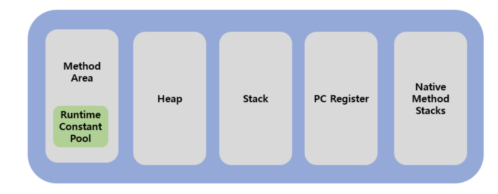

# JVM(Java Virtual Machine)

- 자바 가상 머신, 스택 기반 가상머신이다.
- 바이트 코드를 OS에 특화된 코드로 변환하여 실행한다.
- 특정 기기나 OS에 종속되지 않는 런타임 환경을 제공한다.
- 다르게 말해서 바이트코드를 어떻게 실행할 수 있는가에 대한 스펙
- 바이트코드 실행, 메모리 관리, 보안, 플랫폼 독립성 제공(이식성 증가), 성능 최적화 등

## 1. JDK vs JRE vs JVM

- JDK : Java **개발을 위해** 사용. 컴파일 기능 포함
- JRE : Java 애플리케이션을 **실행하기 위해** 사용. JVM, 라이브러리, 그리고 기타 파일을 포함
- JVM : Java 바이트코드를 실행하는 플랫폼 독립적인 실행 환경

### JDK

- 자바 개발 시 필요한 라이브러리들과 도구이 포함되어 있다.
- 개발 도구에는 javac, java, javadoc, jdbc 등이 포함된다.
- JRE, JVM을 포함한다.

### JRE

- 자바 애플리케이션을 실행할 수 있도록 구성된 배포된 패키지
- JVM + 라이브러리
- 런타임 환경에서 사용하는 프로퍼티 세팅이나 리소스 파일 포함 (rt.jar, 프로퍼티 세팅)
- javac와 같은 개발 관련 도구는 JRE가 아닌 JDK에서 제공한다.
- 자바 11이후로는 개별 설치 불가.

### 플랫폼 독립성

- java는 플랫폼에 독립적이다. javac로 컴파일된 바이트코드는 어떤 JVM에서도 실행될 수 있다.
- 하지만 JVM 내부의 JIT 컴파일러와 인터프리터는 바이트코드를 특정 플랫폼의 기계어로 변환하여 실행한다. 이 부분은 플랫폼 종속적이다.

## 2. JVM 구조

- 클래스 로더(Class Loader)
- 실행 엔진(Execution Engine)
  - 인터프리터(interpreter)
  - JIT 컴파일러(Just-in-time)
  - GC(Garbage collector)
- 런타임 데이터 영역(Runtime Data Area)
  - Method Area
  - Heap Area
  - PC Register
  - Stack Area
  - Native Method
- JNI(Native Method Interface)
- 네이티브 메소드 라이브러리 (Native Method Library)

### 2.1. 클래스 로더(Class Loader)

- 클래스 파일(\*.class)을 동적으로 로드하고, 링크를 통해 배치하는 작업을 수행
- 로드된 바이트 코드를 엮어서 Runtime Data Area에 배치한다.
- Loading -> Linking -> Initialization

### 2.2. 실행 엔진(Execution Engine)

- Runtime Data Area의 바이트 코드를 명령어 단위로 읽어서 실행한다.
- 인터프리터와 JIT 컴파일러 두 가지 방식을 혼합하여 기계어로 변경해준다.

#### 2.2.1. 인터프리터

- 명령어를 하나씩 읽어서 해석하고 바로 실행한다.

#### 2.2.2. JIT 컴파일러

- 반복되는 코드를 최적화해준다.
- 반복되는 바이트 코드 전체를 컴파일하여 Native Code로 변경하고 캐싱하여 직접 실행하는 방식

### 2.3. GC

- Heap 메모리 영역에서 더는 사용하지 않는 메모리를 자동으로 회수한다.

### 2.4. 런타임 데이터 영역(Runtime Data Area)

- JVM의 메모리 영역

#### 2.4.1. Method(Static) Area

- 클래스와 인터페이스에 대한 런타임 상수 풀, 메서드와 필드, static 변수, 메서드 바이트 코드 등을 보관

#### 2.4.2. Heap Area

- 런타임 시 동적으로 할당하여 사용하는 메모리 영역. (new 연산자를 통한 객체 또는 인스턴스와 배열)

#### 2.4.3. PC Register

- 현재 실행 중인 JVM 주소

#### 2.4.4. Stack Area

- FILO, 메서드 호출 시 생성되는 스레드 수행정보를 기록한다.
- 메서드 정보, 지역변수, 매개변수, 연산 중 발생하는 임시 데이터 저장

#### 2.4.5. Native Method Stack Area

- 자바 외 언어로 작성된 네이티브 코드를 위한 메모리
- native 메서드의 매개변수, 지역변수 등을 바이트코드로 저장

## 2.5. JVM 동작 방식

1. 자바 프로그램을 실행하면 JVM은 OS로부터 메모리를 할당받는다.
2. 자바 컴파일러(javac)가 자바 소스코드(.java)를 자바 바이트 코드(.class)로 변환한다.
3. Class Loader는 동적 로딩을 통해 필요한 클래스들을 로딩 및 링크 하여 Runtime Data Area에 올린다.
4. Runtime Data Area에 로딩 된 바이트 코드는 Execution Engine을 통해 해석된다.
5. 이 과정에서 Execution Engine에 의해 Garbage Collector의 작동과 Thread 동기화가 이루어진다.

### 클래스 로더 동작

로드 - 링크 - 초기화

1. Loading(로드) : 클래스 파일을 가져와서 JVM의 메모리에 로드한다.
2. Linking(링크) : 클래스 파일을 사용하기 위해 검증하는 과정이다.

- verifying(검증) : 읽어들인 클래스가 JVM 명세에 명시된 대로 구성되어 있는지 검사
- preparing(준비) : 클래스가 필요로 하는 메모리를 할당
- resolving(분석) : 클래스의 상수 풀 내 모든 심볼릭 레퍼런스를 다이렉트 레퍼런스로 변경

3. Initialization(초기화) : 클래스 변수들을 적절한 값으로 초기화한다. ( static 필드들을 설정된 값으로 초기화 등 )

### 상수 풀(Constant Pool)

- 클래스의 상수 풀은 메소드 영역 내에 위치하며, 해당 클래스에서 사용되는 리터럴과 심볼릭 레퍼런스를 포함링킹 - 과정의 해석(Resolution) 단계에서, 이 상수 풀 내의 심볼릭 레퍼런스는 실제 메모리 주소나 참조로 변환

### 네이티브 코드

- 자바가 아닌 다른 언어로 작성된 코드
- 네이티브 코드가 시스템 라이브러리나 외부 네이티브 라이브러리를 직접 호출한다. 그래서 JNI를 사용하여 호출되는 네이티브 코드는 JVM이 관리하는 힙 메모리가 아닌, **운영 체제의 네이티브 메모리 영역**에 적재된다.
- 네이티브 코드는 JVM의 가비지 컬렉터의 관리 범위 밖에 있다.
- 네이티브 메모리는 자바가 관리하지 않는 메모리를 말한다.

## 참고

- https://inpa.tistory.com/entry/JAVA-%E2%98%95-JDK-JRE-JVM-%EA%B0%9C%EB%85%90-%EA%B5%AC%EC%84%B1-%EC%9B%90%EB%A6%AC-%F0%9F%92%AF-%EC%99%84%EB%B2%BD-%EC%B4%9D%EC%A0%95%EB%A6%AC#jre_java_runtime_environment
- https://inpa.tistory.com/entry/JAVA-%E2%98%95-JVM-%EB%82%B4%EB%B6%80-%EA%B5%AC%EC%A1%B0-%EB%A9%94%EB%AA%A8%EB%A6%AC-%EC%98%81%EC%97%AD-%EC%8B%AC%ED%99%94%ED%8E%B8#%EC%9E%90%EB%B0%94_%EA%B0%80%EC%83%81_%EB%A8%B8%EC%8B%A0jvm%EC%9D%98_%EA%B5%AC%EC%A1%B0
- https://steady-coding.tistory.com/305
- https://gyoogle.dev/blog/computer-language/Java/%EC%BB%B4%ED%8C%8C%EC%9D%BC%20%EA%B3%BC%EC%A0%95.html
- [JVM 동작 그림 출처](https://kingofbackend.tistory.com/123)
- https://yejingo.tistory.com/112
- https://www.inflearn.com/course/the-java-code-manipulation/dashboard
- 참고하기 https://d2.naver.com/helloworld/1230
