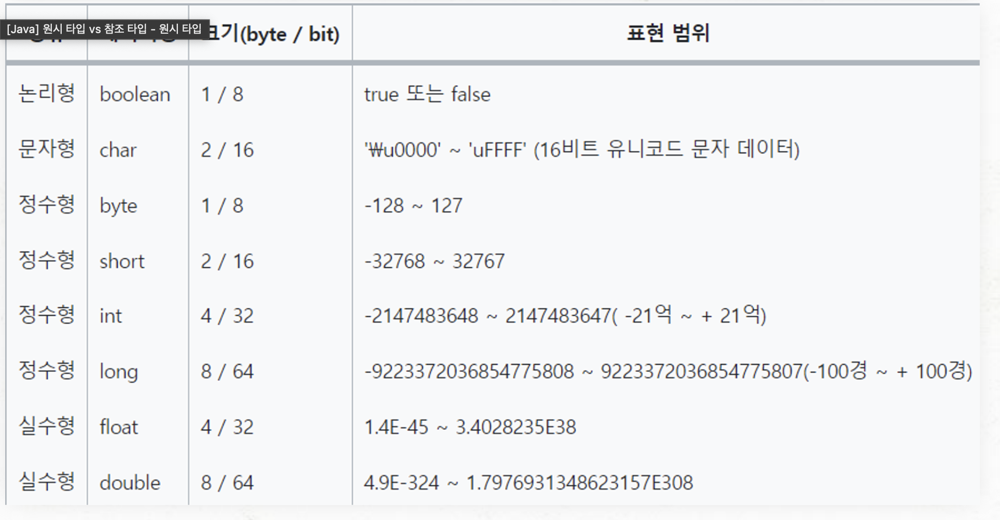
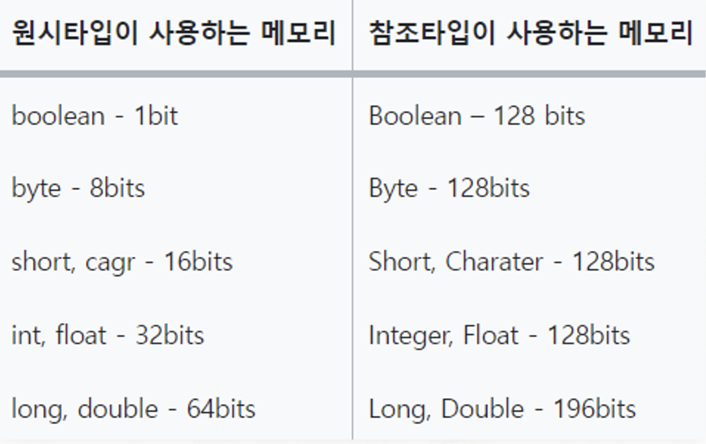
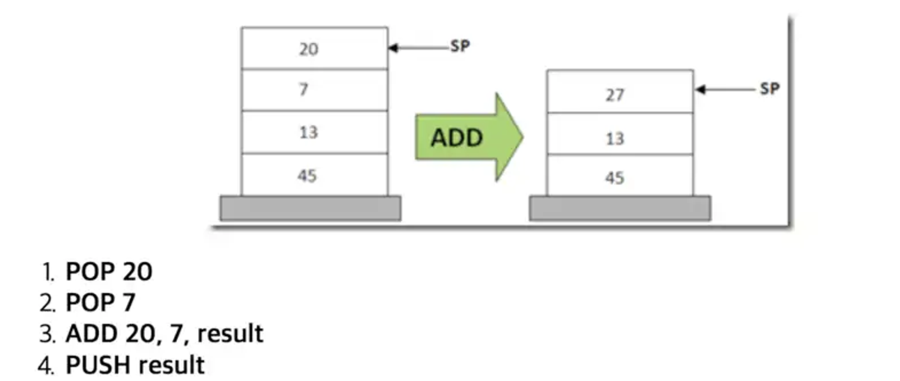

# 원시타입(Primitive Type) vs 참조 타입(Reference Type)

- 타입(Data type)이란 해당 데이터가 메모리에 어떻게 저장되고, 프로그램에서 어떻게 처리되어야 하는지를 명시적으로 알려주는 것
- 자바에서 타입은 크게 기본형 타입과 참조형 타입이 있다.

       ► 기본형(primitive type): 논리형, 문자형, 정수형, 실수형이 있다. 계산을 위해 실제 값을 저장합니다.
       ► 참조형(reference type): 객체의 주소를 저장한다. null 또는 객체의 주소(4byte, 0x0 ~ 0xffffffff)를 갖는다.

## Primitive Type과 Reference Type을 나눈 이유?

효율성과 명확성을 제공하기 위해서이다. Primitive Type은 고정된 크기를 차지하며, 단순하고 빠르며 효율적이다. 반면 Reference Type은 (객체의 생성과 가비지 컬렉션에 따른) 추가적인 오버헤드가 발생할 수 있으나 복잡한 데이터 구조와 상호작용을 가능하게 하여 필수적이다.

## Primitive Type

- 구성 : 총 8가지의 기본형 타입(Primitive type)을 미리 정의하여 제공한다.
- 저장 : 스택 메모리에 직접 값을 저장하며, 고정된 크기와 단순한 메모리 구조로 인해 연산이 빠르고 효율적이다.
- 성능 : 값에 직접 접근하기 때문에 참조 타입보다 메모리 사용과 접근 속도 측면에서 효율적이다.
- null값을 담을 수 없고, 값이 없으면 디폴트 값을 반환한다.
- 제네릭 타입 사용 불가
- 타입 안전성을 제공한다.

## Reference Type

- 구성 : 기본형 타입을 제외한 모든 타입들로 문자열 타입, 배열, 열거 타입, 클래스 타입, 인터페이스 타입 등이 있다.
- 저장 : 힙(Heap) 메모리에 값이 저장되며, 참조의 경우 스택 영역(지역변수, 매개변수, 반환값)이나 힙 영역(다른 객체의 필드)로 저장될 수 있다.
- 성능 : 참조 타입은 최소 2번 메모리 접근을 해야하며,
- 빈 객체를 의미하는 null이 존재한다.
- 제네릭 타입 사용 가능
- 문법상 에러가 없어도 런타임 에러가 발생할 수 있다. ex) NullPointException

## char 연산이 int로 변환되는 이유

- JVM은 연산할 때 피연산자 스택을 활용한다. 계산한 결과를 스택에 집어 넣고, 다음 연산을 진행하여 계산한 결과를 또 다시 스택에 집어 넣는 방식으로 반복한다.
- 이때, JVM의 피연산자 스택은 피연산자를 4 Bytes 단위로 저장한다.
- 그래서 char나 short와 같이 int보다 작은 자료형의 값을 계산하면 int형으로 자동 형 변환된다.

## 참고

- https://goldfishhead.tistory.com/109
- https://steady-coding.tistory.com/606
- https://gyoogle.dev/blog/computer-language/Java/Primitive%20type%20&%20Reference%20type.html
